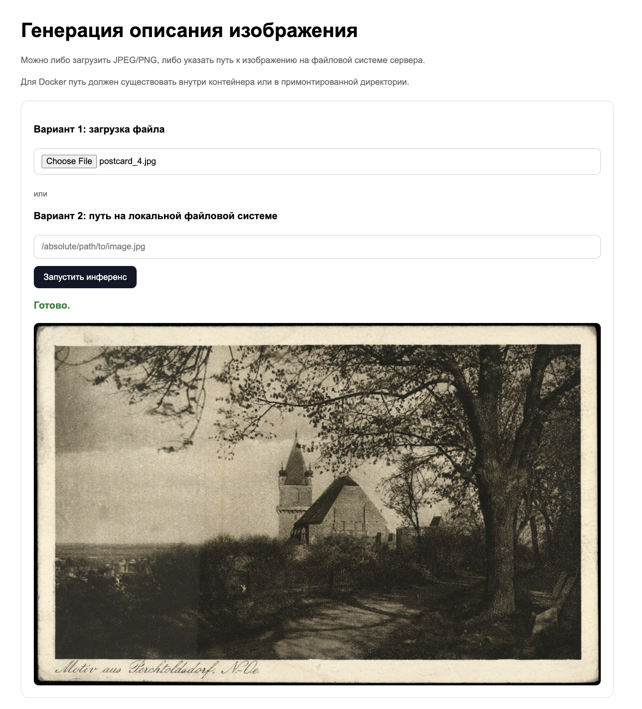
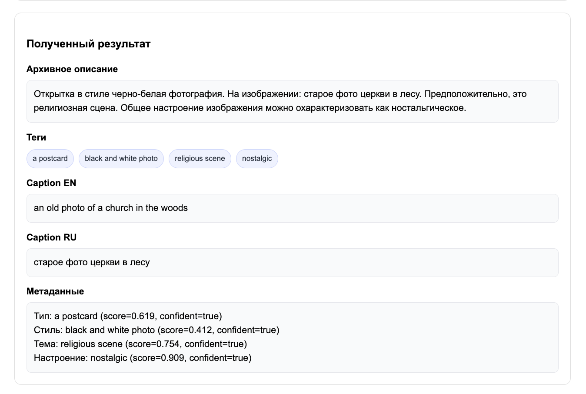
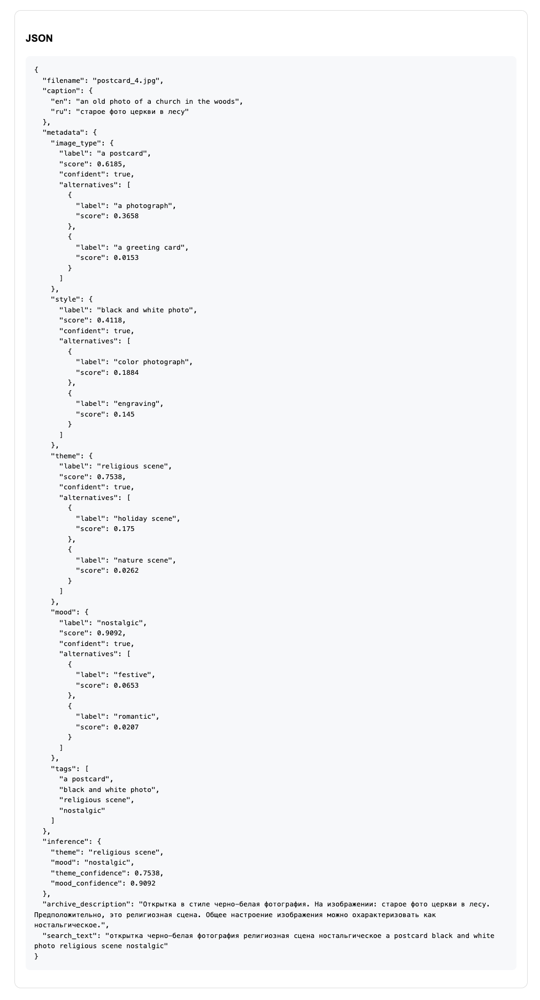

# Генерация содержательного описания изображений открыток и плакатов

ВКР, магистратура ТГУ, 2026  
**Направление:** компьютерное зрение и нейронные сети

## Обзор проекта

Данный проект реализует MVP-систему автоматической генерации структурированных и семантически насыщенных описаний изображений открыток и плакатов.

Основная цель проекта — улучшение поиска, каталогизации и доступа к визуальным материалам в цифровых архивах и библиотеках. Система преобразует изображение в набор человекочитаемых и машинно-обрабатываемых артефактов:
- текстовое описание изображения;
- перевод описания на русский язык;
- семантические метаданные;
- архивное описание;
- поисковый текст для индексации.

Проект находится на стыке компьютерного зрения и обработки естественного языка и использует мультимодальный пайплайн на основе предобученных моделей.

## Постановка задачи

В цифровых библиотечных фондах значительная часть визуальных материалов либо не имеет подробного текстового описания, либо описана вручную и непоследовательно. Это ухудшает:
- полноту поиска;
- качество индексации;
- удобство каталогизации;
- повторное использование материалов в цифровых коллекциях.

В рамках MVP решается задача автоматической обработки одного изображения с формированием структурированного результата в формате JSON.

На вход система принимает изображение открытки или плаката, а на выходе возвращает:
- caption на английском языке;
- перевод caption на русский язык;
- семантические признаки изображения;
- агрегированное архивное описание;
- поисковый текст.

## Цель MVP

Цель текущей версии — собрать воспроизводимый end-to-end сервис, демонстрирующий полный цикл обработки изображения:
1. загрузка изображения;
2. запуск модельного пайплайна;
3. формирование итогового описания;
4. возврат результата через API и минимальный UI;
5. упаковка решения в Docker.

## Архитектурный подход

Система реализована как модульный vision-language пайплайн, в котором этапы восприятия, семантической интерпретации и генерации текста разделены на независимые компоненты.

Это позволяет:
- упростить отладку;
- сделать систему расширяемой;
- заменять отдельные компоненты без полного переписывания решения;
- подготовить архитектуру для дальнейшего fine-tuning моделей в рамках ВКР.

Общая логика пайплайна:

```text
Изображение
   ↓
Caption Generator (BLIP)
   ↓
Translator (MarianMT)
   ↓
Metadata Extractor (SigLIP, zero-shot)
   ↓
Theme Inference / Semantic Aggregation
   ↓
Description Builder
   ↓
JSON-результат
```
## Логическая архитектура системы

### API Layer
Принимает запрос, валидирует входные данные и запускает пайплайн.

Поддерживаемые сценарии:
- загрузка изображения как файла;
- передача пути к локальному изображению.

### Input Validation and Image Preparation
На входном этапе система:
- принимает изображение как файл или путь к локальному файлу;
- проверяет корректность формата и целостность изображения;
- выполняет базовую подготовку изображения к инференсу, включая конвертацию в RGB.

Отдельный модуль предобработки в текущем MVP не выделен: эта логика распределена между API-слоем, сервисным слоем и model processors используемых моделей.

### Caption Generator
Генерирует базовое описание изображения на английском языке.

Модель:
- BLIP (`Salesforce/blip-image-captioning-base`)

Выход:
- краткий caption сцены на английском языке.

### Translator
Переводит caption с английского на русский язык.

Модель:
- MarianMT (`Helsinki-NLP/opus-mt-en-ru`)

Выход:
- русскоязычная версия caption.

### Metadata Extractor
Извлекает семантические признаки изображения в zero-shot режиме.

Модель:
- SigLIP (`google/siglip-base-patch16-224`)

Определяемые категории:
- тип изображения;
- стиль;
- тематика;
- настроение.

Выход:
- top-k гипотезы по каждой категории;
- confidence score;
- набор тегов.

### Theme Inference
Нормализует и агрегирует семантические признаки, полученные на предыдущем этапе.

Выход:
- согласованные поля метаданных для итогового описания.

### Description Builder
Объединяет:
- caption на английском;
- перевод на русский;
- метаданные;
- семантический контекст.

Формирует:
- архивное описание;
- поисковый текст;
- итоговый JSON-ответ.

## Структура проекта

```text
tsu-image-description/
├── app/
│   ├── api/                    # FastAPI endpoints и схемы
│   │   ├── main.py
│   │   └── schemas.py
│   ├── core/                   # конфигурация и служебные модули
│   ├── services/               # обвязка инференса и работа с файлами
│   └── ui/
│       └── index.html          # web UI
│
├── data/
│   ├── images/                 # примеры изображений
│   └── eval/                   # контрольный набор и references
│
├── src/
│   ├── run_demo.py             # локальный запуск пайплайна
│   ├── evaluate.py             # расчет метрик
│   └── tsu_image_description/
│       ├── __init__.py
│       ├── models.py
│       ├── pipeline.py
│       ├── siglip_metadata_extractor.py
│       ├── theme_inference.py
│       └── description_builder.py
│
├── mounted_data/               # примонтированные изображения для Docker
├── requirements.txt
├── docker-compose.yml
├── Dockerfile
├── README.md
└── CHANGELOG.md
```
## Установка

### Клонирование репозитория

```bash
git clone <repo_url>
cd tsu-image-description
```

## Установка зависимостей

```bash
pip install --upgrade pip
pip install -r requirements.txt
```

## Запуск
### Локальный запуск API

```bash
uvicorn app.api.main:app --reload
```

После запуска сервис будет доступен по адресу:

```bash
http://127.0.0.1:8000
```

### Основные endpoints

`GET /health` — проверка состояния сервиса
`POST /inference` — инференс на одном изображении

### Пример запроса через curl
Передача файла

```bash
curl -X POST "http://127.0.0.1:8000/inference" \
  -F "file=@/absolute/path/to/image.jpg"
```

Передача пути к изображению
```bash
curl -X POST "http://127.0.0.1:8000/inference" \
  -F "image_path=/absolute/path/to/image.jpg"
```

## Запуск через Docker

```bash
docker compose up --build
```

После запуска:
- UI: `http://localhost:8000`
- health: `http://localhost:8000/health`

### Работа с локальными файлами в Docker
Изображения можно положить в директорию:
``bash
./mounted_data/
``
Тогда внутри контейнера путь к файлу будет:

```bash
/mounted_data/example.jpg
```

## Демонстрация

### Интерфейс сервиса


### Результат инференса


### Результат инференса


## Тестирование и оценка качества

Для проверки MVP был собран контрольный набор из 7 изображений открыток с краткими эталонными описаниями. 
Открытки и описания были взяты из электронного каталога Национальной Электронной Библиотеки (НЭБ) Российской Государственной Библиотеки.

Текстовое совпадение проверятлось между парами "эталонное описани <-> caption RU" с помощью метрик `BLUE`, `METEOR` и ряда вспомогательных метрик. 
Соответствие сгенерированного архивного описания и изображения проверялом с помощью метрики `CLIPScore` 

### Используемые метрики

- **BLEU** — измеряет совпадение сгенерированного краткого описания с эталонным текстом на уровне n-грамм.
- **METEOR** — оценивает текстовое сходство более гибко, с учётом словоформ и частичных совпадений.
- **CLIPScore** — измеряет согласованность итогового архивного описания с содержанием изображения.
- **Latency** — среднее время обработки одного изображения.
- **Images/sec** — средняя пропускная способность системы.

### Результаты

- **BLEU:** `4.5450`
- **METEOR:** `0.0638`
- **CLIPScore:** `0.2513`
- **Latency:** `0.7169` сек
- **Images/sec:** `1.3949`

### Интерпретация

Полученные результаты показывают, что MVP стабильно выполняет полный цикл обработки изображения и формирует содержательные описания в автоматическом режиме. 
На текущем baseline-этапе наилучший результат демонстрируют показатели производительности, а значения `BLEU`, `METEOR` и `CLIPScore`g отражают базовый уровень качества до этапа доменного дообучения модели.


## Лицензия

Проект распространяется под лицензией **MIT**.

Лпицензия репозитория распространяется на исходный код проекта.  
Используемые предобученные модели и внешние данные регулируются их собственными лицензиями и условиями использования.