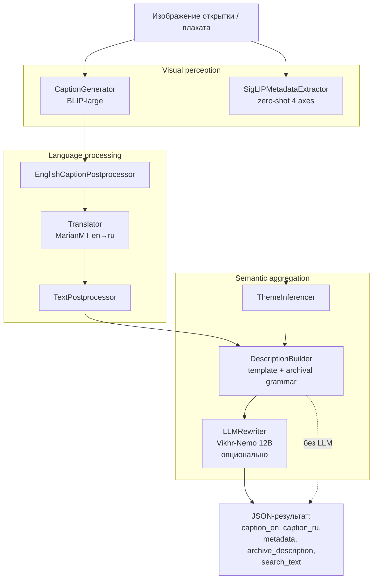

# Разработка интеллектуального программного обеспечения для генерации содержательного и семантического описания художественных изображений

ВКР, магистратура ТГУ, 2026
**Направление:** компьютерное зрение, vision-language модели, информационный поиск

## Обзор

Цифровые архивы и библиотеки (НЭБ, NYPL, РГБ и др.) содержат значительные объёмы художественных изображений — открыток, плакатов, гравюр, иллюстраций — для которых текстовое описание либо отсутствует, либо составлено вручную и непоследовательно. Это снижает полноту поиска, ухудшает качество индексации и затрудняет повторное использование материалов.

Цель работы — разработать программное обеспечение, которое по одному изображению автоматически генерирует:
- содержательное caption-описание (на английском и русском языках),
- структурированные семантические метаданные (тип материала, техника, сюжет, эпоха),
- агрегированное архивное описание на русском языке,
- поисковый текст с архивно-релевантными тегами.

## Предложенный метод и архитектура

В основу метода положен **модульный vision-language пайплайн**, в котором этапы перцепции, семантической интерпретации и генерации текста разделены на независимые компоненты. Каждый этап решает узкую подзадачу при помощи замороженной предобученной модели и лёгкой настроенной/эвристической обвязки сверху. Такая декомпозиция:

- упрощает воспроизводимость и отладку отдельных этапов;
- позволяет заменять модули без переписывания всего решения (например, BLIP → BLIP-large + LoRA, или подключить LLM-rewriter);
- даёт возможность измерять вклад каждого блока через ablation-эксперименты;
- сокращает требования к данным — большинство компонентов работают в zero-shot режиме.

### Состав пайплайна

| # | Модуль | Модель / реализация | Назначение |
|---|---|---|---|
| 1 | `CaptionGenerator` | BLIP (`Salesforce/blip-image-captioning-large`) | Краткое английское caption-описание изображения |
| 2 | `EnglishCaptionPostprocessor` | rule-based | Очистка артефактов BLIP (повторы, обрывы) |
| 3 | `Translator` | MarianMT (`Helsinki-NLP/opus-mt-en-ru`) | Перевод caption EN → RU |
| 4 | `TextPostprocessor` | rule-based | Нормализация русского caption (пунктуация, регистр, типичные ошибки перевода) |
| 5 | `SigLIPMetadataExtractor` | SigLIP (`google/siglip-base-patch16-224`) | Zero-shot классификация по 4 осям: тип материала / техника / сюжет / настроение. Поддерживает версионируемые таксономии (`legacy_v1`, `archival_v2`) |
| 6 | `ThemeInferencer` | rule-based | Семантическая агрегация и нормализация признаков с margin-confidence фильтрацией |
| 7 | `DescriptionBuilder` | template-based | Сборка финального архивного описания и search_text по архивной грамматике |
| 8 | `LLMRewriter` *(опционально)* | Vikhr-Nemo-12B-Instruct-R | Литературная переработка template-описания с сохранением фактологии |

### Схема архитектуры


```mermaid
flowchart TD
    IMG[Изображение открытки / плаката]

    subgraph CV [Visual perception]
        BLIP[CaptionGenerator<br/>BLIP-large]
        SigLIP[SigLIPMetadataExtractor<br/>zero-shot 4 axes]
    end

    subgraph NLP [Language processing]
        ENPP[EnglishCaptionPostprocessor]
        TRANS[Translator<br/>MarianMT en→ru]
        RUPP[TextPostprocessor]
    end

    subgraph SEM [Semantic aggregation]
        THEME[ThemeInferencer]
        BUILD[DescriptionBuilder<br/>template + archival grammar]
        LLM[LLMRewriter<br/>Vikhr-Nemo 12B<br/>опционально]
    end

    OUT[JSON-результат:<br/>caption_en, caption_ru,<br/>metadata, archive_description,<br/>search_text]

    IMG --> BLIP
    IMG --> SigLIP
    BLIP --> ENPP --> TRANS --> RUPP
    SigLIP --> THEME
    RUPP --> BUILD
    THEME --> BUILD
    BUILD --> LLM
    LLM --> OUT
    BUILD -. без LLM .-> OUT
```

### Версионирование таксономии

Модуль `SigLIPMetadataExtractor` хранит замороженные словари классов для каждой версии таксономии. Это обеспечивает **воспроизводимость экспериментов**: запуски, проведённые с `legacy_v1`, можно полностью повторить, переключив флаг `--taxonomy-version`. Действующая таксономия `archival_v2` основана на признанных каталожных стандартах (Файнштейн Э.Б. «В мире открытки», 1976; MARC 21 п. 655; Getty AAT — Print processes / Subjects).

## Оценка качества

Ключевая проблема прикладной оценки — **на момент проектирования метрик отсутствовали общедоступные русскоязычные корпуса открыток / художественных изображений с архивной разметкой**, пригодной как gold reference. Это сделало невозможной классическую supervised-оценку через BLEU/METEOR/BERTScore против эталонных описаний.

> Замечание: в мае 2026 г. в НЭБ появились новые поля «Вариант заглавия» и «Примечание содержания» с curator-grade визуальными описаниями (например, коллекция №529 «Ленинград в Великой Отечественной войне»). Этот источник может быть использован как gold reference для расширенной supervised-оценки в дальнейших экспериментах — но на этапе проектирования метрик такой разметки не существовало.

Поэтому в работе предложен **набор reference-free сигналов**, измеряющих качество описания без эталонных текстов:

| Метрика | Что измеряет |
|---|---|
| **CLIPScore_EN** | Согласованность английского caption с изображением (multilingual CLIP, cosine similarity) |
| **CLIPScore_RU** (`caption_ru`) | То же для русского caption-перевода |
| **CLIPScore_RU** (`archive_ru`) | Согласованность финального архивного описания с изображением |
| **t2i_R@k** (k=1, 5, 10) | Cross-modal retrieval: насколько надёжно описание возвращает соответствующее изображение в коллекции (proxy на «полезность для поиска») |
| **SDS** (Semantic Density Score) | Доля из 6 архивно-релевантных семантических осей, покрытых описанием (тип материала / визуальный сюжет / стиль / эпоха / культурный контекст / тон). Замеряется двумя независимыми способами: keyword-detector и LLM-судья (Claude Sonnet) |
| **Latency** | Среднее время инференса одного изображения |

Дополнительно: малый curated test-set (n=14 semantic testset, n=60 RGB+NYPL mixed) с ручными референсами используется для sanity-check и paired-сравнений конфигураций.

## Эксперименты валидации

Полный лог — в `docs/experiments_log.md`. Кратко:

| ID | Описание | Что проверяется |
|---|---|---|
| **E00** | Baseline: BLIP + MarianMT + zero-shot SigLIP (legacy_v1) + template | Воспроизводимая база |
| **E01** | BLIP-base vs BLIP-large | Влияние backbone-объёма на CLIPScore |
| **E05a–d** | Варианты `DescriptionBuilder` (caption-only, theme+mood, smart template) | Вклад template-логики и таксономии |
| **E06b** | Переход с `legacy_v1` на `archival_v2` | Влияние каталожной таксономии на retrieval и SDS |
| **E08** | LoRA fine-tune на ArtCap (мягкие гиперпараметры) | Польза доменного дообучения BLIP; диагностика catastrophic forgetting |
| **E12** | LLM-rewriter (Vikhr-Nemo-12B) поверх template-описания | Прирост качества от литературной обработки на сохранённой фактологии |
| **+** | SigLIP probe на SemArt (19K paintings, 5 классов) | Диагностика zero-shot: 57% → 89% при supervised linear probe — показывает потенциал features при правильной таксономии |

Каждый эксперимент сохраняется как JSON-артефакт с полем `summary.config` (модели, hyperparameters, taxonomy_version, флаги) — это обеспечивает откат к любому ранее проведённому прогону.

## Структура проекта

```text
tsu-image-description/
├── app/                              # FastAPI приложение (API + UI)
│   ├── api/                          # endpoints, схемы
│   ├── core/                         # конфигурация
│   ├── services/                     # обвязка инференса
│   └── ui/index.html                 # web UI
│
├── src/tsu_image_description/        # библиотека (pipeline и компоненты)
│   ├── pipeline.py                   # ArchiveDescriptionPipeline
│   ├── models.py                     # BLIP CaptionGenerator + MarianMT Translator
│   ├── siglip_metadata_extractor.py  # zero-shot taxonomy classifier (versioned)
│   ├── theme_inference.py            # semantic aggregator
│   ├── description_builder.py        # template builder + archival grammar
│   ├── text_postprocessor.py         # RU caption cleanup
│   ├── english_caption_postprocessor.py
│   └── llm_rewriter.py               # Vikhr-Nemo LLM rewriter (E12)
│
├── scripts/                          # entry-point скрипты
│   ├── evaluate.py                   # триадные метрики (CLIPScore_RU + R@k + SDS)
│   ├── eval_stats.py                 # bootstrap CI + paired test
│   ├── compute_sds.py                # Semantic Density Score (keyword / LLM mode)
│   ├── llm_judge.py                  # LLM-as-judge оценка
│   ├── run_demo.py                   # инференс на одной картинке
│   ├── train_blip_lora_v2.py         # LoRA fine-tune BLIP
│   ├── benchmark_siglip_on_semart.py # zero-shot SigLIP vs SemArt ground-truth
│   ├── siglip_theme_probe.py         # supervised linear probe (Option B)
│   └── scrape_neb_collection.py      # сбор открыток + curator-описаний с НЭБ
│
├── data/
│   ├── eval/                         # eval set + references
│   ├── semart/                       # SemArt benchmark + probe features
│   ├── neb_leningrad_wwii/           # НЭБ-открытки (manifest + thumbnails)
│   └── nypl/                         # NYPL training data
│
├── notebooks/                        # анализ embedding'ов и сравнений
├── docs/                             # план + лог экспериментов
├── demo/screenshots/                 # скриншоты для README
├── requirements.txt
├── docker-compose.yml
├── Dockerfile
└── README.md
```

## Запуск

### Установка

```bash
git clone <repo_url>
cd tsu-image-description
pip install --upgrade pip
pip install -r requirements.txt
```

### Локальный запуск API

```bash
uvicorn app.api.main:app --reload
```

Сервис доступен по адресу `http://127.0.0.1:8000`.

Основные endpoints:
- `GET /health` — проверка состояния
- `POST /inference` — инференс на одном изображении

Пример запроса:
```bash
# передача файла
curl -X POST "http://127.0.0.1:8000/inference" \
  -F "file=@/absolute/path/to/image.jpg"

# передача пути к локальному изображению
curl -X POST "http://127.0.0.1:8000/inference" \
  -F "image_path=/absolute/path/to/image.jpg"
```

### Запуск через Docker

```bash
docker compose up --build
```

После запуска UI доступен на `http://localhost:8000`. Локальные изображения можно положить в `./mounted_data/` — внутри контейнера путь будет `/mounted_data/<filename>`.

### Запуск экспериментов из CLI

```bash
# Инференс на одном изображении
PYTHONPATH=src python scripts/run_demo.py --image data/eval/images/postcard_1.jpg

# Полная оценка (триадные метрики на eval-set)
PYTHONPATH=src python scripts/evaluate.py \
  --experiment-name E06b_archival_v2_n60 \
  --eval-set data/eval/references_n60.jsonl \
  --taxonomy-version archival_v2 \
  --output data/eval/results/metrics_E06b_archival_v2_n60.json

# Benchmark SigLIP zero-shot vs SemArt ground-truth
PYTHONPATH=src python scripts/benchmark_siglip_on_semart.py \
  --split val --taxonomy archival_v2 \
  --output data/semart/benchmark_archival_v2_val.json

# Supervised linear probe на SigLIP features (Option B)
PYTHONPATH=src python scripts/siglip_theme_probe.py \
  --output data/semart/probe_theme_archival_v2.json

# Сбор открыток с curator-описаниями из НЭБ (опц., для расширенной оценки)
python scripts/scrape_neb_collection.py \
  --output-dir data/neb_leningrad_wwii --delay 1.0
```

## Демонстрация

### Интерфейс сервиса


### Результат инференса


### JSON-ответ


## Лицензия

Проект распространяется под лицензией **MIT**.

Лицензия репозитория распространяется на исходный код. Используемые предобученные модели и внешние данные регулируются их собственными лицензиями и условиями использования.
