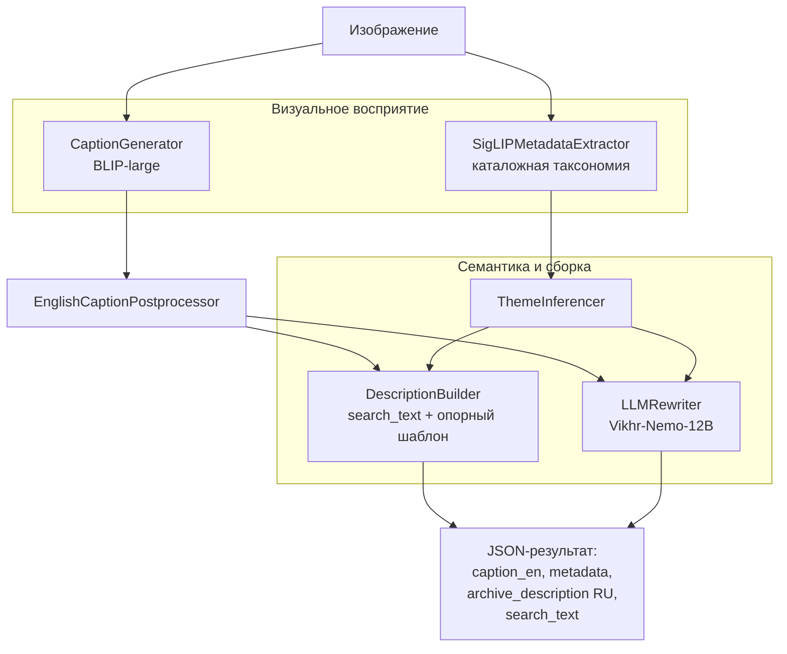
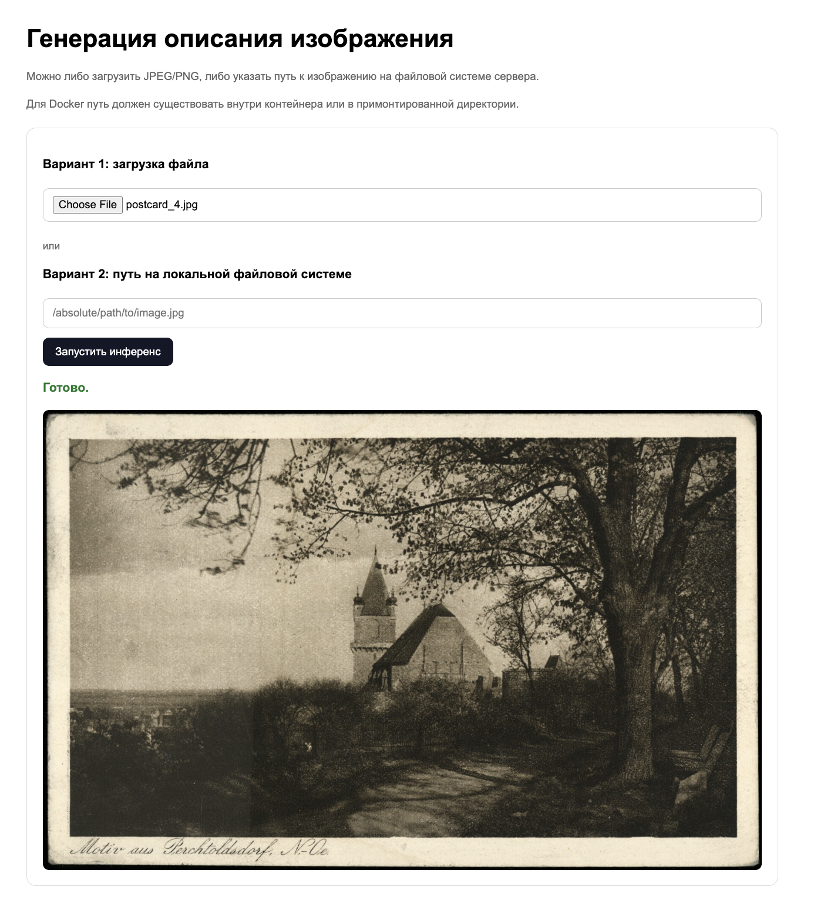
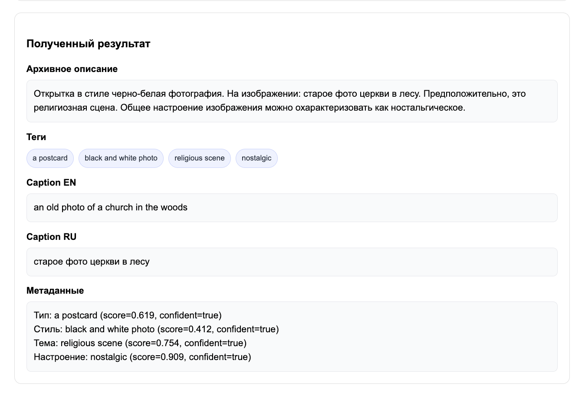
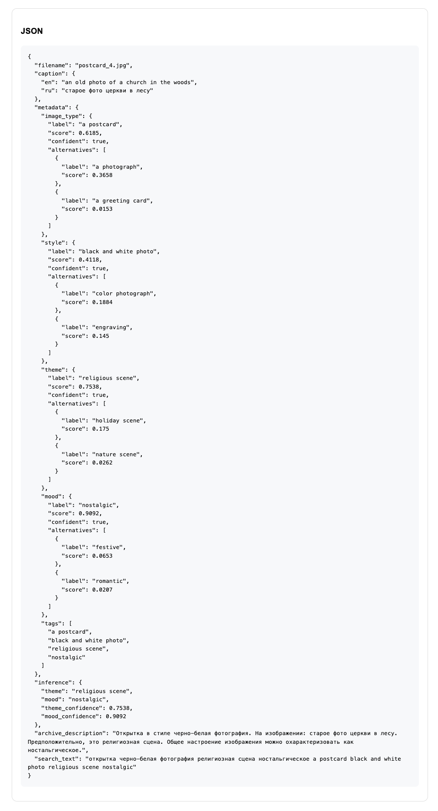

# Разработка интеллектуального программного обеспечения для генерации содержательного и семантического описания художественных изображений

ВКР, магистратура ТГУ, 2026
**Направление:** компьютерное зрение, vision-language модели, информационный поиск

## Аннотация

В работе решается задача автоматической генерации структурированных архивных описаний на русском языке для художественных изображений из фондов цифровых библиотек (открытки и плакаты) с целью повышения полноты поиска, последовательности каталогизации и переиспользуемости визуальных материалов.

Современные крупные end-to-end vision-language модели (LLaVA, Qwen-VL и др.) обеспечивают высокое качество, однако их применение в данной задаче ограничено: они требуют значительных вычислительных ресурсов, остаются мало интерпретируемыми (промежуточные семантические признаки скрыты), а их доменная адаптация ресурсоёмка и подвержена катастрофическому забыванию (catastrophic forgetting) общих знаний при настройке на узкий корпус. 

В работе предлагается модульный пайплайн, в котором задача декомпозируется на узкие подзадачи (визуальное распозновение содержания, классификация по архивной таксономии, литературная переработка), каждая решается отдельным компонентом. Реализация воспроизводимо упакована в Docker и валидирована на собственном эталонном наборе, а также на размеченной коллекции [«Ленинград в Великой Отечественной войне 1941–1945 гг.: открытки»](https://rusneb.ru/collections/529_leningrad_v_velikoy_otechestvennoy_voyne_1941_1945_gg_otkrytki/) Российской Государственной Библиотеки.

## Предложенный метод и архитектура

Пайплайн состоит из шести модулей. Каждый представляет собой замороженную предобученную модель или rule-based компонент с узкой функцией. Архивная специфика заключена в каталожной таксономии классификатора и в prompt-инструкции языкового редактора.Эти параметры могут быть адаптированы под конкретные задачи внутри РГБ.

| # | Модуль                                                             | Модель / реализация | Особенности                                                                                                                         |
|---|--------------------------------------------------------------------|---|-------------------------------------------------------------------------------------------------------------------------------------|
| 1 | `ГенераторПодписи`/<br/>`CaptionGenerator`                         | BLIP-large (`Salesforce/blip-image-captioning-large`) | Английская подпись по изображению                                                                                                   |
| 2 | `ПостпроцессорАнглийскойПодписи`/<br/>`EnglishCaptionPostprocessor` | rule-based | Очистка артефактов BLIP (повторы, обрывы)                                                                                           |
| 3 | `ЭкстракторМетаанныхSigLIP`/<br/>`SigLIPMetadataExtractor`         | SigLIP-base (`google/siglip-base-patch16-224`) | Zero-shot классификация по категориям; каталожная таксономия на основе Файнштейн Э. Б. (1976), MARC 21, Getty AAT                   |
| 4 | `ОпределительТемы`/<br/>`ThemeInferencer`                               | rule-based | Агрегация полей; отбрасывает неуверенные и неоднозначные результаты классификации                                                   |
| 5 | `КонструкторОписания`/<br/>`DescriptionBuilder`                         | template-based | Поисковые теги и шаблонная заготовка описания                                                     |
| 6 | `ЯзыковойРедакторLLM`/<br/>`LLMRewriter`                                | Vikhr-Nemo-12B-Instruct-R | Генерация финального русского архивного описания по английской подписи + метаданным; собственная prompt-инструкция в архивном стиле |


```mermaid
flowchart TD
    IMG[Изображение]

    subgraph CV [Визуальное восприятие]
        BLIP[CaptionGenerator<br/>BLIP-large]
        SigLIP[SigLIPMetadataExtractor<br/>каталожная таксономия]
    end

    ENPP[EnglishCaptionPostprocessor]

    subgraph SEM [Семантика и сборка]
        THEME[ThemeInferencer]
        BUILD[DescriptionBuilder<br/>search_text + опорный шаблон]
        LLM[LLMRewriter<br/>Vikhr-Nemo-12B]
    end

    OUT[JSON-результат:<br/>caption_en, metadata,<br/>archive_description RU,<br/>search_text]

    IMG --> BLIP --> ENPP
    IMG --> SigLIP --> THEME
    ENPP --> BUILD
    THEME --> BUILD
    ENPP --> LLM
    THEME --> LLM
    BUILD --> OUT
    LLM --> OUT
```

**Особенности подхода.** Все компоненты используют замороженные предобученные веса; обучение не требуется. Версионируемые таксономии обеспечивают воспроизводимость экспериментов. Каждый этап интерпретируем (промежуточные выходы — текст и структурированные поля), что упрощает отладку и аудит.

## Оценка качества

Рассматриваемая задача носит генеративный характер: для одного изображения возможно множество корректных описаний разной формы. Размеченных эталонных описаний для большинства изображений архивных фондов на данный момент нет; в отдельных тематических коллекциях разметка присутствует, но в ограниченном объёме. Поэтому основным инструментом оценки служит набор **метрик без разметки** (reference-free).

### `CLIPScore` (семантическое соответствие текста и изображения)

- Мера согласованности между текстовым описанием и изображением. Вычисляется как косинусное сходство их векторных представлений, полученных контрастивно-обученной мультимодальной моделью (CLIP / SigLIP / M-CLIP).
- Выше значение -> описание семантически ближе к содержанию изображения; около нуля — слабо связано.

### `Cross-modal retrieval` (поисковая релевантность)

- Описание используется как поисковый запрос по пулу всех изображений набора; считается, насколько часто целевое изображение возвращается в топ-k результатов (R@1, R@5, R@10).
- Непосредственно отражает полезность описания как поискового признака: чем ближе R@1 к единице, тем выше шанс найти нужный документ по его автоматическому описанию.

### Среднее время инференса (Latency)

- Среднее время обработки одного изображения, включая загрузку и все стадии пайплайна. Характеризует пригодность системы к генерации описаний на большом корпусе изображений.

## Сводные метрики предложенного решения

Эталонный конфиг (BLIP-large без дообучения + SigLIP с каталожной таксономией + LLM-rewriter Vikhr-Nemo-12B) измерен на трёх независимых выборках. CLIPScore приведён в трёх вариантах для разных текстовых полей:

- **CLIPScore по английской подписи** — соответствие подписи (caption_en) изображению, измерено CLIP ViT-B-32 OpenAI.
- **CLIPScore по русской подписи** — то же для русского перевода подписи (caption_ru), измерено M-CLIP (XLM-Roberta-Large × ViT-B-32).
- **CLIPScore по архивному описанию** — соответствие финального описания (archive_description) изображению, M-CLIP.

| Выборка | n | CLIPScore (caption_en) | CLIPScore (caption_ru) | CLIPScore (archive RU) | t2i R@1 | t2i R@5 | Latency, сек |
|---|---:|---:|---:|---:|---:|---:|---:|
| Эталонные семантические тесты | 14 | 0.319 | 0.335 | 0.331 | 1.00 | 1.00 | 12.1 |
| Смешанная (открытки РГБ + NYPL) | 60 | 0.301 | 0.312 | 0.319 | 0.70 | 0.97 | 19.4 |
| Коллекция №529 НЭБ с разметкой | 224 | 0.287 | 0.292 | 0.309 | 0.30 | 0.61 | 18.2 |

Размер пула retrieval растёт от 14 к 224 (на больших пулах R@1 структурно ниже, так как задача значительно сложнее). Все CLIPScore вычислены на тех же изображениях, что и retrieval.

## Экспериментальная валидация

Предложенное решение получено серией экспериментов, сгруппированных по направлениям ниже. Все артефакты (JSON-результаты, чекпоинты дообучения, конфигурации) воспроизводимы и сохранены в `data/eval/results/` и `models/`.

### Дообучение моделей

Проверялись возможности повышения качества за счёт дообучения BLIP-large на трёх доступных корпусах изображений с подписями: `NYPL` (≈6.6 тыс. открыток из открытого архива Нью-Йоркской публичной библиотеки), `ArtCap` (≈4 тыс. пар «изображение–подпись» о произведениях искусства) и `SemArt` (≈8 тыс. пар после фильтрации до коротких visual-описаний из ≈19 тыс. художественных полотен).

Основные наблюдения:

- Первая серия экспериментов по дообучению: на корпусе данных NYPL, ближайшему по жанру к нашей задаче открытому корпусу открыток. Экспертных описаний для NYPL нет, поэтому обучающие пары собирались по схеме CapFilt: BLIP-base сам генерировал подписи к изображениям, CLIP-фильтр отсеивал слабые пары, а в финальный обучающий набор включалась гибридная строка `подпись + " . " + название записи NYPL`. Проверены и полное дообучение, и LoRA (r=16) в нескольких конфигурациях. Главное ограничение, проявившееся на качественном аудите: конкатенация каталожных названий NYPL в каждую обучающую подпись смещает модель в сторону лексики и стиля метаданных NYPL («trade card», «greeting card. the walter baker co.»), а не описаний предметной области. Эксперимент послужил мотивацией для перехода к корпусам с более чистыми подписями.
- Дообучение на ArtCap даёт стабильное снижение всех агрегатных метрик относительно базовой модели — даже с консервативными гиперпараметрами (низкая скорость обучения, высокий dropout, одна эпоха). Образец: подписи смещаются в стилистику атрибуции («painting by ...», «artwork in the style of ...»), теряется способность описывать общие категории.
- Дообучение на SemArt с теми же мягкими гиперпараметрами впервые превысило базовую модель по retrieval-метрике (R@1 на смешанной выборке поднялся с 0.73 до 0.85) и по CLIPScore по подписи. Однако при сравнении эпох 0 / 1 / 2 чётко видна точка перелома: после первой эпохи downstream-метрики деградируют, хотя ошибка на валидационной выборке SemArt продолжает падать.
- Качественный аудит вывода показывает побочный эффект — лучший SemArt-checkpoint (epoch 0) генерирует конкретные топонимы и атрибуты, которые не являются частью изображения (например, изображению русского города приписывается несуществующий западноевропейский храм). Это делает дообученный вариант непригодным как решения описательной задачи для архивов, где фактологическая точность критична.

**Главный вывод.** Дообучение работоспособно, но при текущих корпусах вызывает сдвиг распределения в сторону домена обучающих данных. При получении более крупного и тематически релевантного корпуса (например, собственная размеченная подвыборка фондов РГБ — советская, дореволюционная, и тд. тематика) дообучение становится очень перспективным направлением, особенно для повышения детализации описаний на специфически российских сюжетах, которые не представлены в общих англоязычных корпусах.

### Таксономия классификатора

Сравнивались две версии таксономии для zero-shot SigLIP-классификатора:

- **Начальная** — разговорные категории первого приближения («винтажный», «декоративный», «ретро»), не привязанные к признанным стандартам каталогизации.
- **Каталожная** — категории, согласованные с признанными источниками: Файнштейн Э. Б. «В мире открытки» (1976), MARC 21 поле 655, Getty AAT (Print processes / Subjects).

Каталожная таксономия снижает CLIPScore по архивному описанию примерно на 0.02 (мультиязычный CLIP менее знаком с такими терминами как «хромолитография», «офорт», чем с разговорным «винтажная открытка»), но улучшает поисковую релевантность: средняя позиция целевого изображения в выдаче (когда описание используется как поисковый запрос) снижается с 1.92 до 1.85 — чем меньше число, тем выше изображение в результатах поиска.

**Главный вывод.** Каталожная таксономия — правильный выбор для архивного применения: cross-modal retrieval является прямым показателем полезности для поиска, тогда как CLIPScore чувствителен к лексическому распределению обучающих данных мультиязычного CLIP. Кроме того, описания, опирающиеся на признанные каталожные источники, удобнее интегрируются в существующие системы классификаций.

### Способ генерации финального описания

Проверялись три способа сборки финального русского архивного описания:

- **Шаблонная сборка с прямым переводом** — таблица соответствий «метаданные классификатора → русское слово», подставляемая в шаблон; русская подпись получается машинным переводом английской. Проверялись два переводчика: `MarianMT` (`Helsinki-NLP/opus-mt-en-ru`, специализированная пара EN→RU) и `NLLB-200` (`facebook/nllb-200-distilled-600M`, мультиязычная модель Meta). Заметной разницы между ними по агрегатным метрикам не обнаружилось; `MarianMT` оставлен как более лёгкая и быстрая модель (≈300 млн параметров против ≈600 млн у `NLLB-200-distilled-600M`).
- **Языковая модель — основная конфигурация** — Vikhr-Nemo-12B получает на вход английскую подпись + структурированные метаданные и пишет связное русское архивное описание в одном шаге, минуя промежуточный буквальный перевод.
- **Альтернативная prompt-инструкция** — та же языковая модель с переписанной инструкцией: убрана преамбула типа материала, выход в стиле «Примечание содержания» РНБ (именные и причастные конструкции).

Языковая модель устраняет известные дефекты буквального перевода (полисемия «painting» → «картина» / «покраска», транслитерация имён собственных вместо ботанических терминов «Holly» / «остролист») и даёт грамматически естественные описания. Альтернативная prompt-инструкция приводит описание к более компактному curator-стилю, но снижает CLIPScore по архивному описанию на ≈0.03 — преамбула с указанием техники помогала мультиязычному CLIP связать описание с изображением.

**Главный вывод.** Языковая модель как редактор поверх метаданных классификатора — основной способ генерации в предложенном решении; prompt-инструкция допускает изолированную настройку стиля без переобучения. Альтернативная экспертная инструкция сохраняется как опция для пользовательских сценариев, где приоритет — стилистическая близость к каталогизатору, а не семантическая близость по CLIPScore.

### Supervised-классификация на замороженных признаках

Чтобы понять, ограничивает ли качество zero-shot подход к классификации (текстовые prompts) или сами визуальные признаки SigLIP-кодировщика, обучен линейный классификатор поверх замороженных image-эмбеддингов на двух разных корпусах:

- На корпусе SemArt (≈15.8 тыс. размеченных полотен, 5 классов сюжетной категории) zero-shot точность составила 57.1 %, тогда как линейный классификатор, обученный за 3 секунды, дал **89.5 %** на отложенной выборке — рост на 32 процентных пункта на тех же визуальных признаках.
- На собственной размеченной коллекции открыток (322 шт. с указанной техникой) такой же классификатор различает три класса техники (литография / автотипия / цинкография) с точностью 88.7 % на отложенной выборке; cross-domain проверка на смешанной выборке (РГБ + NYPL) не показала коллапса в один доминирующий класс.

**Главный вывод.** Узкое место текущего zero-shot подхода — текстовые prompts, а не сам визуальный кодировщик: SigLIP-признаки уже содержат большую часть информации, необходимой для каталожной классификации. Архитектурно подготовлена возможность опционально подключить supervised-классификатор поверх существующего экстрактора для тех осей (тип материала, техника), где есть размеченные данные — без замены основного набора компонентов решения.

### Валидация на коллекции с экспертной разметкой

В Российской национальной библиотеке опубликована коллекция №529 «Ленинград в Великой Отечественной войне 1941–1945 гг. (открытки)» — 324 открытки, для большинства которых заполнены поля «Вариант заглавия» (RUSMARC 540) и «Примечание содержания» (RUSMARC 327) с экспертными описаниями визуального содержания. Этот источник позволил проверить методологически важный вопрос: могут ли reference-free метрики (CLIPScore и retrieval) служить мерой качества вместо экспертного эталонного описания. Положительный ответ на этот вопрос критичен для практического применения метода — для подавляющего большинства изображений архивных фондов экспертная разметка отсутствует, и без замещающей меры качество автоматических описаний пришлось бы оценивать вручную для каждой коллекции.

После фильтрации к 224 открыткам с полноценным curator-описанием прогнаны производственная и альтернативная конфигурации пайплайна; сравнение проведено по BERTScore_RU (семантическая близость на уровне эмбеддингов мультиязычного BERT), chrF (character-level сходство, толерантнее к морфологии русского языка), ROUGE-L и BLEU.

Результаты:

| Конфигурация | BERTScore_RU | ROUGE-L | chrF |
|---|---:|---:|---:|
| Основная (LLM-rewriter с архивной преамбулой) | 0.658 | 0.104 | 14.6 |
| Альтернативная (LLM-rewriter в curator-стиле) | 0.663 | 0.129 | 10.0 |

Качественный аудит топ- и низ-ранжированных примеров показал, что основное расхождение с curator-описаниями объясняется отсутствием в пайплайне модуля распознавания именованных сущностей (специфические landmarks, исторические лица, военная атрибутика). Этот разрыв — фундаментальный предел метода на текущем backbone и обозначен как направление будущей работы.

**Главный вывод.** Дополнительная supervised-валидация подтверждает, что reference-free сигналы (CLIPScore, retrieval) направленно коррелируют с экспертным восприятием, при этом основным методом оценки остаётся reference-free набор: размеченных коллекций архивного масштаба недостаточно для полностью supervised режима оценки, тогда как reference-free метрики применимы ко всему фонду.

## Технический контекст

### Установка

```bash
git clone <repo_url>
cd tsu-image-description
pip install --upgrade pip
pip install -r requirements.txt
```

### Локальный запуск API

```bash
uvicorn app.api.main:app --reload
```

Сервис доступен по адресу `http://127.0.0.1:8000`. Endpoints:

- `GET /health` — проверка состояния
- `POST /inference` — инференс на одном изображении (файл или путь)

Пример:

```bash
curl -X POST "http://127.0.0.1:8000/inference" -F "file=@/path/to/image.jpg"
```

### Контейнеризация

Полный пайплайн упакован в Docker-образ; конфигурация — `Dockerfile` + `docker-compose.yml`. Однокомандный запуск:

```bash
docker compose up --build
```

После старта UI доступен на `http://localhost:8000`. Локальные изображения монтируются через `./mounted_data/` → `/mounted_data/`. Веса моделей кэшируются в именованном volume `hf_cache` и не перекачиваются при пересборке.

**Состав образа:** Python 3.12-slim; PyTorch CPU-сборка для переносимости (на машинах с GPU локальный запуск ускоряет инференс в 5–10 раз); набор библиотек зафиксирован в `requirements.docker.txt`. Healthcheck — на endpoint `/health` (start_period 120 сек на загрузку моделей).

**Ресурсные требования:** минимум 8 ГБ RAM без языкового редактора; 32 ГБ для конфигурации с Vikhr-Nemo-12B в fp16 (по умолчанию языковой редактор в Docker-конфигурации отключён, так как CPU-инференс 12B-модели нецелесообразен по латентности).

### Запуск экспериментов из CLI

```bash
# Инференс на одном изображении
PYTHONPATH=src python scripts/run_demo.py --image data/eval/images/postcard_1.jpg

# Полная оценка на собственном эталонном наборе
PYTHONPATH=src python scripts/evaluate.py \
  --references data/eval/references.jsonl \
  --use-llm-rewriter \
  --taxonomy-version archival_v2 \
  --output data/eval/results/metrics_run.json

# Reference-based метрики против curator-разметки
PYTHONPATH=src python scripts/eval_reference_based.py \
  --input data/eval/results/metrics_run.json \
  --output data/eval/results/refbased_run.json \
  --fields archive_ru,caption_ru

# Сбор открыток с curator-описаниями из НЭБ
python scripts/data/scrape_neb_collection.py \
  --output-dir data/neb_leningrad_wwii --delay 1.0
```

### Воспроизводимость

Каждый эксперимент сохраняется как JSON с полем `summary.config`, содержащим версию таксономии, модели, гиперпараметры и флаги CLI. Этого достаточно для точного восстановления любой ранее проведённой конфигурации.

## Структура проекта

```text
tsu-image-description/
├── app/                              # FastAPI приложение (API + UI)
├── src/tsu_image_description/        # библиотека (pipeline и компоненты)
│   ├── pipeline.py
│   ├── models.py                     # CaptionGenerator (BLIP)
│   ├── english_caption_postprocessor.py
│   ├── siglip_metadata_extractor.py  # zero-shot classifier (versioned taxonomy)
│   ├── theme_inference.py
│   ├── description_builder.py        # search_text + опорный шаблон
│   ├── llm_rewriter.py               # Vikhr-Nemo: финальное русское описание
│   └── text_postprocessor.py
├── scripts/
│   ├── evaluate.py                   # основная оценка
│   ├── eval_reference_based.py       # BERTScore_RU + chrF + ROUGE-L + BLEU
│   ├── eval_stats.py                 # bootstrap CI + paired test
│   ├── llm_judge.py                  # LLM-as-judge
│   ├── run_demo.py
│   ├── preload_models.py
│   ├── exp_db.py
│   ├── data/                         # ingestion / sampling
│   ├── probes/                       # supervised SigLIP-эксперименты
│   └── _legacy/                      # архив воспроизводимости
├── data/
│   ├── eval/                         # эталонные наборы + результаты
│   ├── semart/                       # бенчмарк + признаки для probe
│   ├── neb_leningrad_wwii/           # размеченная коллекция №529
│   └── nypl/                         # NYPL training data
├── notebooks/                        # анализ embedding'ов и результатов
├── docs/                             # лог экспериментов, рубрики, планы
├── demo/screenshots/
├── requirements.txt
├── requirements.docker.txt
├── docker-compose.yml
└── Dockerfile
```

## Будущая работа

1. **Замена базовой модели подписей.** Замена BLIP-large на инструктивно-тюненную vision-language модель (BLIP-2, Qwen2-VL, LLaVA-NEXT) прогнозируемо поднимет детальность подписи и снимет часть generic-фейлов.
2. **Дообучение на собственном корпусе РГБ.** Сбор и разметка более крупного и тематически релевантного корпуса (советская, дореволюционная, видовая открытка) с последующим LoRA-дообучением — наиболее многообещающий путь повышения качества на специфически российских сюжетах.
3. **Интеграция supervised-классификатора в основной пайплайн.** Добавить опциональный режим экстрактора метаданных, использующий обученный линейный классификатор поверх замороженных SigLIP-признаков на тех осях, где есть размеченные данные.
4. **Распознавание именованных сущностей.** Основное ограничение текущего метода — отсутствие распознавания landmarks, исторических лиц, надписей на самом изображении. Возможные направления: классификатор архивных landmarks; OCR + NER на текстовых подписях; instruct-tuned VLM с phrase-grounding prompt.

## Демонстрационный набор для рецензирования РНБ

Для качественной оценки экспертом подобран сбалансированный набор из 10 открыток с парами «эталонное описание ↔ автоматически сгенерированное описание»: 5 открыток РГБ (разные сюжетные категории) и 5 открыток коллекции №529 НЭБ (внутри коллекции выбраны разные сюжеты — городской пейзаж, военный сюжет, праздничная карточка, портрет, карикатура).

Файл выборки — `demo/review_set_rgb_rnb.md`; генерируется командой:

```bash
PYTHONPATH=src python scripts/data/build_review_set.py --output demo/review_set_rgb_rnb.md
```

Эксперту предлагается оценить семантическую близость к эталону, удобочитаемость, отсутствие фабрикаций и пригодность описания как поискового признака.

## Демонстрация

### Интерфейс сервиса


### Результат инференса


### JSON-ответ


## Лицензия

Проект распространяется под лицензией **MIT**.

Лицензия репозитория распространяется на исходный код. Используемые предобученные модели и внешние данные регулируются их собственными лицензиями и условиями использования.
