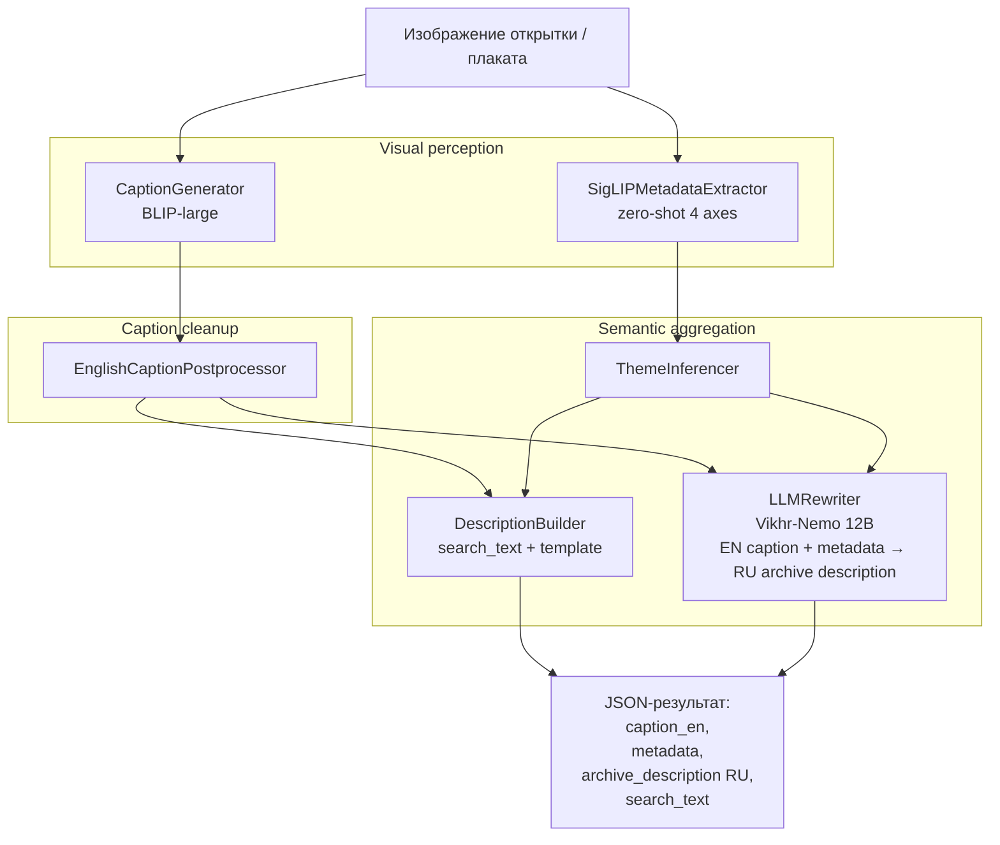

# Разработка интеллектуального программного обеспечения для генерации содержательного и семантического описания художественных изображений

ВКР, магистратура ТГУ, 2026
**Направление:** компьютерное зрение, vision-language модели, информационный поиск

## Обзор

Цифровые архивы и библиотеки содержат значительные объёмы художественных изображений — открыток, плакатов, гравюр, иллюстраций — для которых текстовое описание либо отсутствует, либо составлено вручную. Это снижает полноту поиска, ухудшает качество индексации и затрудняет повторное использование материалов.

Цель работы – разработать программное обеспечение, которое по одному изображению автоматически генерирует:
- содержательное описание (caption) (на английском и русском языках),
- структурированные семантические метаданные (тип материала, техника, сюжет, и пр.),
- агрегированное архивное описание на русском языке.

## Предложенный метод и архитектура

В основу метода положен **модульный vision-language пайплайн**, в котором этапы перцепции, семантической интерпретации и генерации текста разделены на независимые компоненты. Каждый этап решает узкую подзадачу при помощи замороженной предобученной модели и лёгкой настроенной/эвристической обвязки сверху. Такая декомпозиция:

- упрощает воспроизводимость и отладку отдельных этапов;
- позволяет заменять модули без переписывания всего решения (например, BLIP → BLIP-large + LoRA, или подключить LLM-rewriter);
- даёт возможность измерять вклад каждого блока через ablation-эксперименты;
- сокращает требования к данным — большинство компонентов работают в zero-shot режиме.

### Состав пайплайна

| # | Модуль | Модель / реализация | Назначение |
|---|---|---|---|
| 1 | `CaptionGenerator` | BLIP (`Salesforce/blip-image-captioning-large`) | Краткое английское caption-описание изображения |
| 2 | `EnglishCaptionPostprocessor` | rule-based | Очистка артефактов BLIP (повторы, обрывы) |
| 3 | `SigLIPMetadataExtractor` | SigLIP (`google/siglip-base-patch16-224`) | Zero-shot классификация по 4 осям: тип материала / техника / сюжет / настроение. Поддерживает версионируемые таксономии (`legacy_v1`, `archival_v2`) |
| 4 | `ThemeInferencer` | rule-based | Семантическая агрегация и нормализация признаков с margin-confidence фильтрацией |
| 5 | `DescriptionBuilder` | template-based | Сборка `search_text` (закрытая таксономия для retrieval-индексации) и опорного template-описания |
| 6 | `LLMRewriter` | Vikhr-Nemo-12B-Instruct-R | Генерация финального русского архивного описания напрямую из английского caption и semantic-метаданных (заменил MarianMT-перевод, использовавшийся в ранних экспериментах E00–E08) |

### Схема архитектуры


```mermaid
flowchart TD
    IMG[Изображение открытки / плаката]

    subgraph CV [Visual perception]
        BLIP[CaptionGenerator<br/>BLIP-large]
        SigLIP[SigLIPMetadataExtractor<br/>zero-shot 4 axes]
    end

    subgraph CLEAN [Caption cleanup]
        ENPP[EnglishCaptionPostprocessor]
    end

    subgraph SEM [Semantic aggregation]
        THEME[ThemeInferencer]
        BUILD[DescriptionBuilder<br/>search_text + template]
        LLM[LLMRewriter<br/>Vikhr-Nemo 12B<br/>EN caption + metadata → RU archive description]
    end

    OUT[JSON-результат:<br/>caption_en,<br/>metadata,<br/>archive_description RU,<br/>search_text]

    IMG --> BLIP
    IMG --> SigLIP
    BLIP --> ENPP
    SigLIP --> THEME
    ENPP --> BUILD
    THEME --> BUILD
    ENPP --> LLM
    THEME --> LLM
    BUILD --> OUT
    LLM --> OUT
```

### Версионирование таксономии

Модуль `SigLIPMetadataExtractor` хранит замороженные словари классов для каждой версии таксономии. Это обеспечивает **воспроизводимость экспериментов**: запуски, проведённые с `legacy_v1`, можно полностью повторить, переключив флаг `--taxonomy-version`. Действующая таксономия `archival_v2` основана на признанных каталожных стандартах (Файнштейн Э.Б. «В мире открытки», 1976; MARC 21 п. 655; Getty AAT — Print processes / Subjects).

## Оценка качества

Ключевая проблема прикладной оценки — **на момент проектирования метрик отсутствовали общедоступные русскоязычные корпуса открыток / художественных изображений с архивной разметкой**, пригодной как gold reference. Это сделало невозможной классическую supervised-оценку через BLEU/METEOR/BERTScore против эталонных описаний.

Поэтому в работе предложен **набор reference-free сигналов**, измеряющих качество описания без эталонных текстов:

| Метрика | Что измеряет |
|---|---|
| **CLIPScore_EN** | Согласованность английского caption с изображением (multilingual CLIP, cosine similarity) |
| **CLIPScore_RU** (`caption_ru`) | То же для русского caption-перевода |
| **CLIPScore_RU** (`archive_ru`) | Согласованность финального архивного описания с изображением |
| **t2i_R@k** (k=1, 5, 10) | Cross-modal retrieval: насколько надёжно описание возвращает соответствующее изображение в коллекции (proxy на «полезность для поиска») |
| **Latency** | Среднее время инференса одного изображения |

Дополнительно: малый curated test-set (n=14 semantic testset, n=60 RGB+NYPL mixed) с ручными референсами используется для sanity-check и paired-сравнений конфигураций.

## Валидация: серия экспериментов

Метод подтверждается серией из восьми экспериментов. Все эксперименты воспроизводимы: каждый сохраняется как JSON-артефакт с полем `summary.config` (модели, гиперпараметры, версия таксономии, флаги CLI), а конфигурация модулей зафиксирована флагами командной строки в `scripts/evaluate.py`.

Полный лог — `docs/experiments_log.md`.

### Эксперимент 1. Опорный прогон

**Назначение.** Зафиксировать воспроизводимый базис: модульный пайплайн в конфигурации без литературной переработки (использовалась шаблонная сборка `DescriptionBuilder` и разговорная таксономия `legacy_v1`). Внутренний идентификатор результатов: `E00_postproc_display_n60`.

**Конфигурация.** Базовая модель подписей (caption) — BLIP-large; перевод EN→RU — MarianMT; zero-shot классификатор — SigLIP с таксономией `legacy_v1`; сборка архивного описания — шаблонная.

**Выборка.** 60 открыток: 20 размеченных открыток РГБ + 40 открыток NYPL (раздельная отчётность по источнику).

**Результаты (reference-free).**

| Метрика | Значение |
|---|---:|
| `CLIPScore_EN` (англ. подпись против изображения) | 0.301 |
| `CLIPScore_RU` (русская подпись (caption_ru) против изображения) | 0.312 |
| `CLIPScore_RU` (архивное описание (archive_ru) против изображения) | **0.339** |
| `t2i_R@1` (cross-modal retrieval, точность top-1) | 0.733 |
| `mean_rank_t2i` | 1.92 |
| Среднее время инференса | 0.94 сек |

**Что подтверждается.** Сборка `DescriptionBuilder` поднимает релевантность описания изображению на +0.027 (0.312 → 0.339) по сравнению с прямым переводом подписи; модульный подход даёт работающую систему end-to-end с приемлемой латентностью.

### Эксперимент 2. Каталожная таксономия

**Назначение.** Заменить разговорные категории SigLIP-классификатора («винтажный», «декоративный», «ретро») на каталожные термины, согласованные с признанными стандартами архивного описания: Файнштейн Э. Б. «В мире открытки» (1976), MARC 21 поле 655, Getty AAT (Print processes / Subjects). Внутренний идентификатор: `E06b_archival_v2_n60`.

**Изменение.** Только параметр `--taxonomy-version` (legacy_v1 → archival_v2). Остальные модули идентичны Эксперименту 1.

**Результаты (n=60).**

| Метрика | Опорный | Каталожная таксономия | Δ |
|---|---:|---:|---:|
| `CLIPScore_RU` (архивное описание) | 0.339 | 0.319 | **−0.020** |
| `mean_rank_t2i` (ниже — лучше) | 1.92 | 1.85 | **−0.07** |

**Что подтверждается.** Версионируемая таксономия даёт измеримый компромисс: терминология теряет 0.02 по CLIPScore (мультиязычный CLIP хуже знаком с «хромолитографией» и «офортом», чем с «винтажной открыткой»), но улучшает поисковую релевантность (mean_rank снижается). Для архивного применения trade-off оправдан: cross-modal retrieval — прямой proxy «полезности для поиска», а CLIPScore чувствителен к лексическому распределению обучающих данных мультиязычного CLIP.

### Эксперимент 3. Литературная переработка описания

**Назначение.** Заменить шаблонную сборку + перевод MarianMT на единый шаг — генерацию русского архивного описания языковой моделью напрямую из английской подписи и метаданных. Языковая модель — Vikhr-Nemo-12B-Instruct-R (дообученный на русском корпусе вариант Mistral Nemo). Внутренний идентификатор: `E12_neb_n224`.

**Изменение.** Добавлен модуль `LLMRewriter`; вход — английская подпись + поля метаданных SigLIP, выход — связное русское описание в архивном стиле. Параметр `--llm-prompt-style v1_archival`.

**Выборка.** 224 размеченные открытки коллекции №529 РНБ (см. также Эксперимент 8 — это та же выборка).

**Результаты (n=224).**

| Метрика | Значение |
|---|---:|
| `CLIPScore_RU` (архивное описание) | 0.309 |
| `mean_rank_t2i` | 16.86 |
| Среднее время инференса | 18.2 сек |

**Что подтверждается.** Модульность позволяет swap-нуть способ генерации текста без переписывания пайплайна. Литературная переработка устраняет дефекты буквального перевода MarianMT (полисемия painting → картина/покраска; транслитерация имён собственных вместо ботанических терминов), это видно качественно на парных примерах в Эксперименте 8. Reference-free CLIPScore_RU на NEB-коллекции (n=224) ниже, чем на n=60 в Эксперименте 1, — это отражает domain shift: коллекция №529 содержит советские открытки 1941–1945 годов со специфической лексикой, удалённой от обучающего распределения мультиязычного CLIP.

### Эксперимент 4. Альтернативный стилевой prompt

**Назначение.** Проверить, можно ли через одну только модификацию инструкции (prompt) сместить стиль выхода `LLMRewriter` ближе к каталожному языку РНБ. Внутренний идентификатор: `E13_curator_neb_n224`.

**Изменение.** Параметр `--llm-prompt-style v2_curator`: переписанные few-shot примеры и системная инструкция, требующие убрать преамбулу с типом материала («Открытка-хромолитография. ...») и начинать описание сразу с визуального содержания, в именных и причастных конструкциях.

**Выборка.** Те же 224 открытки, что и в Эксперименте 3 (контролируемое A/B).

**Результаты (n=224).**

| Метрика | Литературная переработка | Альтернативный стиль | Δ |
|---|---:|---:|---:|
| `CLIPScore_RU` (архивное описание) | 0.309 | 0.280 | **−0.029** |
| Длина выхода относительно curator-описаний (медиана) | 0.70 | 0.50 | **−0.20** |
| `mean_rank_t2i` | 16.86 | 15.25 | **−1.61** |

**Что подтверждается.** Версионирование prompts (как и таксономии) позволяет изолированное A/B-сравнение. Альтернативный стиль ухудшает CLIPScore (преамбула с указанием техники помогала мультиязычному CLIP связать описание с изображением) и одновременно укорачивает выход в 1.4 раза, при этом немного улучшает retrieval. Practical lesson: prompt-инжиниринг даёт ограниченные сдвиги на одной и той же базовой модели; принципиальные улучшения требуют замены backbone (см. раздел «Будущая работа»).

### Эксперимент 5. Бенчмарк zero-shot классификатора на корпусе живописи

**Назначение.** Измерить объективную точность zero-shot SigLIP-классификатора (каталожная таксономия) против внешнего корпуса с готовой разметкой, не зависимого от собственного eval-набора. Использован SemArt — корпус из ~19 тыс. репродукций классической живописи с экспертными метками типа сюжета (TYPE).

**Метод.** Прогон SigLIP-классификатора по 1 069 изображениям валидационного среза SemArt с маппингом нашей таксономии (themes axis) на 5 пересекающихся классов: religious, portrait, landscape, genre, still-life.

**Результаты.**

| Метрика | Значение |
|---|---:|
| Top-1 accuracy | **0.571** |
| Macro-F1 | 0.607 |

**Что подтверждается.** Zero-shot подход даёт точность ощутимо выше случайной (1/5 = 0.20 при равномерных классах), но потолок далёк: 43% изображений классифицируются неверно. Это устанавливает объективный baseline для оценки supervised-улучшений (см. Эксперимент 6).

### Эксперимент 6. Supervised linear probe на тех же признаках

**Назначение.** Различить два возможных диагноза по Эксперименту 5: (а) сами признаки SigLIP-encoder'а не содержат нужной информации для классификации сюжета, либо (б) текстовые prompts субоптимально извлекают информацию, которая уже есть в визуальных признаках.

**Метод.** Обучение линейного классификатора (sklearn LogisticRegression, `class_weight='balanced'`) поверх замороженных 768-мерных image-эмбеддингов SigLIP, на 15 819 размеченных изображениях обучающего среза SemArt; оценка на тех же 877 valid-изображениях.

**Результаты.**

| Метрика | Zero-shot (Эксп. 5) | Linear probe | Δ |
|---|---:|---:|---:|
| Top-1 accuracy | 0.571 | **0.895** | +0.324 |
| Macro-F1 | 0.607 | **0.874** | +0.267 |
| Train accuracy | — | 0.949 | (gap к val ≈ 5 п. п.) |

**Что подтверждается.** Признаки SigLIP-encoder'а уже содержат информацию, достаточную для 89.5% accuracy на 5-классной задаче. Линейный слой в 3 840 параметрах обучается за 3.4 секунды и поднимает точность на +32.4 пункта без замены encoder'а. Это методологически принципиальный результат: узкое место zero-shot подхода — не SigLIP-фичи, а текстовые prompts. В перспективе пайплайн может быть дополнен опциональным supervised-классификатором поверх существующего SigLIP-extractor'а без замены backbone.

### Эксперимент 7. Доменно-согласованный supervised-классификатор техники на архивных открытках

**Назначение.** Перенести подход Эксперимента 6 на реальную целевую область — открытки. Обучить linear probe на собственной размеченной коллекции открыток (322 шт. коллекции №529 РНБ с указанной техникой в RUSMARC поле 215 $c) и проверить кросс-доменный перенос на смешанной выборке n=60 (РГБ + NYPL, разные эпохи и стили).

**Метод.** Канонизация поля TECHNIQUE в 3 чистых класса:
- литография (включая хромолитографию) — 154 примера;
- автотипия — 98 примеров;
- цинкография — 13 примеров.

Stratified split 80/20 → 212 train, 53 val. Linear probe с балансировкой классов.

**Результаты (in-domain valid, n=53).**

| Класс | Support | Precision | Recall | F1 |
|---|---:|---:|---:|---:|
| литография | 31 | 0.88 | 0.94 | **0.91** |
| автотипия | 20 | 0.94 | 0.80 | 0.87 |
| цинкография | 2 | 0.67 | 1.00 | 0.80 |
| **Все классы (macro)** | 53 | — | — | **0.857** |
| **Accuracy** | 53 | — | — | **0.887** |

**Cross-domain check (n=60, без ground truth).** Probe предсказывает 36 автотипий + 24 литографий, ноль цинкографий; средняя уверенность (top-1 probability) — 0.81. Распределение совместимо с ожиданием: цинкография — узкоспецифичная техника советского военного периода, маловероятна на открытках РГБ/NYPL. Отсутствие collapse в один доминантный класс и адекватная calibration подтверждают, что доменный перенос работоспособен.

**Что подтверждается.** Подход с supervised linear probe переносится на целевую область (открытки), не только на художественный корпус. Узкая тематика обучающей коллекции (Ленинград, 1941–1945) — известное ограничение; для полной валидации кросс-доменной точности необходима ручная разметка ~20 открыток n=60 экспертом-полиграфистом (отнесено в будущую работу).

### Эксперимент 8. Дополнительная валидация на размеченной коллекции РНБ

**Назначение.** В мае 2026 г. НЭБ опубликовала в открытом каталоге коллекции №529 «Ленинград в Великой Отечественной войне 1941–1945 гг. (открытки)» новые поля «Вариант заглавия» (RUSMARC 540) и «Примечание содержания» (RUSMARC 327) с curator-grade описаниями визуального содержания. Это сделало возможной дополнительную supervised-проверку пайплайна, которой не существовало на этапе проектирования метрик.

Reference-free набор остаётся основным методом оценки. Этот эксперимент — дополнительный supervised-сигнал на доступной размеченной коллекции.

**Метод.** Прогон пайплайна (Эксперимент 3: литературная переработка + каталожная таксономия) на 224 открытках, отфильтрованных по критерию `reference ≠ title and length ≥ 4 words` (≈70% коллекции с реальным визуальным описанием в полях 327/540). Сравнение `archive_ru` пайплайна против curator-описания РНБ.

**Reference-based метрики.**

| Конфигурация | n | BERTScore_RU | ROUGE-L | chrF | BLEU |
|---|---:|---:|---:|---:|---:|
| Литературная переработка (Эксп. 3) | 224 | 0.658 | 0.104 | 14.62 | 0.53 |
| Альтернативный стиль (Эксп. 4) | 224 | 0.663 | **0.129** | 10.04 | 0.46 |
| Прямой перевод MarianMT (без литературной переработки) | 224 | 0.667 | 0.108 | 10.63 | 0.27 |

**Что подтверждается.**

1. Reference-free сигналы коррелируют с supervised-оценкой: literarной переработке (Эксп. 3) соответствует BERTScore_RU ≈ 0.66; альтернативный стиль (Эксп. 4) даёт +0.005 BERTScore при −0.029 CLIPScore_RU, что согласуется с trade-off, обнаруженным в reference-free части.

2. Качественный анализ топ-5 и низ-5 примеров по BERTScore_RU показывает: семантическая дистанция объясняется тем, что curator-описания содержат именованные сущности и историко-культурный контекст («А. Гитлер», «Медный всадник», «Адмиралтейство», «маскхалат», «автоматчик-десантник»), которые ни один image-captioning backbone общего назначения (BLIP, BLIP-2, GIT) не распознаёт из изображения. Это **верхняя граница метода** на текущем backbone и явный вектор для будущей работы — замена BLIP-1 на vision-language модель с инструктивной capability (BLIP-2, LLaVA-NEXT, Qwen2-VL) либо добавление модуля распознавания именованных сущностей.

3. BLEU и ROUGE-L на коротких русских описаниях имеют известное ограничение из-за морфологии (несовпадение словоформ); ROUGE-L и chrF информативнее для русского — это согласуется со стандартными рекомендациями по оценке генерации на флективных языках.

## Структура проекта

```text
tsu-image-description/
├── app/                              # FastAPI приложение (API + UI)
│   ├── api/                          # endpoints, схемы
│   ├── core/                         # конфигурация
│   ├── services/                     # обвязка инференса
│   └── ui/index.html                 # web UI
│
├── src/tsu_image_description/        # библиотека (pipeline и компоненты)
│   ├── pipeline.py                   # ArchiveDescriptionPipeline
│   ├── models.py                     # BLIP CaptionGenerator (Translator — legacy, для E00–E08)
│   ├── english_caption_postprocessor.py
│   ├── siglip_metadata_extractor.py  # zero-shot taxonomy classifier (versioned)
│   ├── theme_inference.py            # semantic aggregator
│   ├── description_builder.py        # search_text + опорное template-описание
│   ├── llm_rewriter.py               # Vikhr-Nemo: финальное русское архивное описание
│   └── text_postprocessor.py         # legacy: нормализатор RU caption для E00–E08
│
├── scripts/                          # entry-point скрипты (verb-based generic CLI)
│   ├── evaluate.py                   # метрики evaluation (CLIPScore + t2i R@k + latency)
│   ├── eval_stats.py                 # bootstrap CI + paired test
│   ├── eval_reference_based.py       # BERTScore_RU + chrF + ROUGE-L + BLEU vs curator refs
│   ├── llm_judge.py                  # LLM-as-judge оценка
│   ├── run_demo.py                   # инференс на одной картинке
│   ├── preload_models.py             # прогрев HF cache
│   ├── exp_db.py                     # SQLite ingest experiment results
│   │
│   ├── data/                         # data ingestion / sampling
│   │   ├── scrape_neb_collection.py  # сбор открыток + curator-описаний с НЭБ
│   │   └── sample_eval_pool.py
│   │
│   ├── probes/                       # SigLIP probe / benchmark experiments
│   │   ├── benchmark_siglip_on_semart.py
│   │   ├── siglip_theme_probe.py
│   │   ├── siglip_technique_probe_neb.py
│   │   └── probe_on_postcards.py
│   │
│   └── _legacy/                      # archived (preserved for reproducibility)
│       ├── train_blip{,_lora,_lora_v2}.py
│       ├── prepare_{artcap,semart,splits}.py
│       └── {generate,filter}_captions.py
│
├── data/
│   ├── eval/                         # eval set + references
│   ├── semart/                       # SemArt benchmark + probe features
│   ├── neb_leningrad_wwii/           # НЭБ-открытки (manifest + thumbnails)
│   └── nypl/                         # NYPL training data
│
├── notebooks/                        # анализ embedding'ов и сравнений
├── docs/                             # план + лог экспериментов
├── demo/screenshots/                 # скриншоты для README
├── requirements.txt
├── docker-compose.yml
├── Dockerfile
└── README.md
```

## Запуск

### Установка

```bash
git clone <repo_url>
cd tsu-image-description
pip install --upgrade pip
pip install -r requirements.txt
```

### Локальный запуск API

```bash
uvicorn app.api.main:app --reload
```

Сервис доступен по адресу `http://127.0.0.1:8000`.

Основные endpoints:
- `GET /health` — проверка состояния
- `POST /inference` — инференс на одном изображении

Пример запроса:
```bash
# передача файла
curl -X POST "http://127.0.0.1:8000/inference" \
  -F "file=@/absolute/path/to/image.jpg"

# передача пути к локальному изображению
curl -X POST "http://127.0.0.1:8000/inference" \
  -F "image_path=/absolute/path/to/image.jpg"
```

### Контейнеризация

Полный пайплайн упакован в Docker-образ; конфигурация — `Dockerfile` + `docker-compose.yml`. Цель — однокомандный запуск сервиса с FastAPI и web-интерфейсом без локальной сборки окружения.

**Состав образа.**

- Базовый образ: `python:3.12-slim`.
- PyTorch: CPU-сборка (`https://download.pytorch.org/whl/cpu`) — для переносимости между машинами без GPU. На M1/CUDA-станциях запуск напрямую через `uvicorn` ускоряет инференс в 5–10 раз.
- HuggingFace-кэш моделей вынесен в именованный volume `hf_cache` (точка монтирования `/models/huggingface`), чтобы веса моделей не перекачивались при пересборке образа.
- Healthcheck на endpoint `/health` (интервал 30 сек, start_period 120 сек на загрузку моделей).

**Запуск.**

```bash
docker compose up --build
```

После старта UI доступен на `http://localhost:8000`. Локальные изображения для инференса монтируются через `./mounted_data/` (host) → `/mounted_data/` (container); путь к файлу внутри контейнера: `/mounted_data/<filename>`.

**Воспроизводимый профиль зависимостей.** Файл `requirements.docker.txt` фиксирует версии библиотек для образа; `requirements.txt` — для локальной разработки (может включать дополнительные dev-зависимости).

**Ресурсные требования.**

- Минимум: 8 ГБ RAM (без `LLMRewriter`, с BLIP-1 + SigLIP + MarianMT).
- Рекомендуется: 16 ГБ RAM для пайплайна без LLM; 32 ГБ для конфигурации с `LLMRewriter` (Vikhr-Nemo-12B в fp16 занимает ~24 ГБ).
- LLM-редактор включается переменной окружения / флагом запуска и по умолчанию отключён в Docker-конфигурации (CPU-инференс LLM-12B нецелесообразен по латентности).

### Запуск экспериментов из CLI

```bash
# Инференс на одном изображении
PYTHONPATH=src python scripts/run_demo.py --image data/eval/images/postcard_1.jpg

# Полная оценка (триадные метрики на eval-set)
PYTHONPATH=src python scripts/evaluate.py \
  --experiment-name E06b_archival_v2_n60 \
  --eval-set data/eval/references_n60.jsonl \
  --taxonomy-version archival_v2 \
  --output data/eval/results/metrics_E06b_archival_v2_n60.json

# Benchmark SigLIP zero-shot vs SemArt ground-truth
PYTHONPATH=src python scripts/probes/benchmark_siglip_on_semart.py \
  --split val --taxonomy archival_v2 \
  --output data/semart/benchmark_archival_v2_val.json

# Supervised linear probe на SigLIP features (Option B)
PYTHONPATH=src python scripts/probes/siglip_theme_probe.py \
  --output data/semart/probe_theme_archival_v2.json

# Сбор открыток с curator-описаниями из НЭБ
python scripts/data/scrape_neb_collection.py \
  --output-dir data/neb_leningrad_wwii --delay 1.0
```

## Демонстрация

### Интерфейс сервиса


### Результат инференса


### JSON-ответ


## Демонстрационный набор для рецензирования РНБ

Для качественной оценки экспертом РНБ подобран сбалансированный набор из 10 открыток с парами «эталонное описание ↔ автоматически сгенерированное архивное описание». Состав набора отражает оба типа целевых материалов: 5 открыток из коллекции РГБ (n=60, разные сюжетные категории) и 5 открыток из коллекции №529 НЭБ (Ленинград, 1941–1945; разные сюжетные категории внутри коллекции).

Источники описаний для сравнения:
- РГБ-открытки — ручные эталоны (поле `reference_short_ru` в `data/eval/references.jsonl`), составленные участником проекта;
- НЭБ-открытки — curator-grade описания из RUSMARC поля 327 «Примечание содержания» (электронный каталог Российской национальной библиотеки).

Файл выборки — `demo/review_set_rgb_rnb.md` (генерируется командой `python scripts/data/build_review_set.py --output demo/review_set_rgb_rnb.md`).

### Состав набора (краткая сводка)

**Из коллекции РГБ (открытки разных эпох и сюжетов):**

| Файл | Эталон (ref) | Описание пайплайна (archive_ru) |
|---|---|---|
| `postcard_1.jpg` | Сосновый лес | Фотография. Чёрно-белое изображение леса с деревьями. |
| `postcard_6.jpg` | Броненосный корабль 'Синоп' | Открытка-гравюра с изображением корабля в воде, из которого идёт дым. |
| `postcard_11.jpg` | Подарочная коробка с красной лентой и ветками омелы внутри | Открытка-хромолитография с изображением рождественской открытки с коробкой и ветвями остролиста |
| `postcard_16.jpg` | Взрослая собака и щенок на снегу | Открытка-хромолитография. Стоящая собака в снегу с другими собаками. |
| `postcard_20.jpg` | Девочка в цветном костюме с цветами | Открытка-хромолитография. Ребёнок в яркой одежде держит цветы. |

**Из коллекции НЭБ №529 (Ленинград, 1941–1945; разные сюжетные категории):**

| Файл | Эталон (RUSMARC 327) | Описание пайплайна |
|---|---|---|
| `..._2085954.jpg` (городской пейзаж) | Вид с Университетской набережной в Ленинграде (от сфинкса) на набережную Красного Флота и Исаакиевский собор | Открытка-гравюра. Рисунок статуи в снегу с зданием на заднем плане. |
| `..._2086119.jpg` (военный сюжет) | Вид с реки Невы в Ленинграде на Стрелку Васильевского острова с Центральным военно-морским музеем | Открытка-гравюра. Здание с часовой башней в пейзажном стиле. |
| `..._2086459.jpg` (праздник / агитация) | Сандружинница, пехотинец, матрос и ополченец на фоне ленинградского пейзажа (Исаакиевский собор и Стрелка Васильевского острова) | Открытка. Водная краска. Группа мужчин в военной форме стоит рядом друг с другом. |
| `..._2087261.jpg` (портрет) | Портрет, голова, прямолично, в круглом медальоне; внизу Петропавловская крепость и памятник Петру I («Медный всадник») | Открытка. Чёрно-белая фотография мужчины с красным бантом. |
| `..._2087463.jpg` (карикатура) | Карикатурное изображение А. Гитлера, теряющего зубы под ударами кулаков с надписями «Ростов», «Москва», «Тихвин-Волхов» | Открытка-хромолитография. Человек держит нож. |

**Назначение набора для эксперта.** Сравнить:
- семантическую близость автоматически сгенерированного описания к экспертному эталону;
- удобочитаемость и архивный стиль русского языка;
- наличие/отсутствие фабрикаций (visual facts, которых нет на изображении);
- пригодность описания как поискового признака.

Известные ограничения метода (видны в наборе и явно зафиксированы в Эксперименте 8): пайплайн не распознаёт именованные сущности (Адмиралтейство, Медный всадник, А. Гитлер), не извлекает текст с открытки (надписи, лозунги), не классифицирует историко-культурный контекст. Эти ограничения — следствие выбора BLIP-1 как backbone; их закрытие — отдельная задача (см. «Будущая работа»).

## Будущая работа

1. **Замена backbone подписей.** Замена BLIP-1 на BLIP-2 / Qwen2-VL / LLaVA-NEXT прогнозируемо поднимает детальность подписи и снимает часть generic-фейлов («здание с часовой башней» → «здание с башенными часами на фоне реки»). Эксперимент с BLIP-2 не выполнен в рамках текущей работы из-за серверной задержки кэша HuggingFace; реализация — 2–3 часа сосредоточенной работы, инфраструктура (флаг `--caption-backend blip2`) уже есть.

2. **Интеграция supervised SigLIP-классификатора в основной пайплайн.** Эксперименты 6–7 показали, что linear probe поверх замороженных SigLIP-фич даёт +32 п. п. accuracy. Естественный следующий шаг — добавить опциональный режим `SigLIPMetadataExtractor(mode='probe')`, который использует обученный классификатор вместо текстовых prompt-ов на тех осях, где есть размеченные данные.

3. **Распознавание именованных сущностей.** Главное ограничение метода — отсутствие распознавания specific landmarks / persons / events на изображении. Возможные направления: классификатор landmark-ов на собственной размеченной коллекции; OCR + NER на текстовых надписях открытки; instruct-tuned VLM (LLaVA-NEXT, Qwen2-VL) с phrase-grounding prompt.

4. **Расширение размеченной коллекции.** В рамках текущей работы использована только коллекция №529 НЭБ (Soviet WWII, узкий домен). Систематический сбор открыток из других коллекций РНБ (дореволюционные, новогодние, видовые) — естественное продолжение для повышения статистической надёжности supervised-валидации.

## Лицензия

Проект распространяется под лицензией **MIT**.

Лицензия репозитория распространяется на исходный код. Используемые предобученные модели и внешние данные регулируются их собственными лицензиями и условиями использования.
