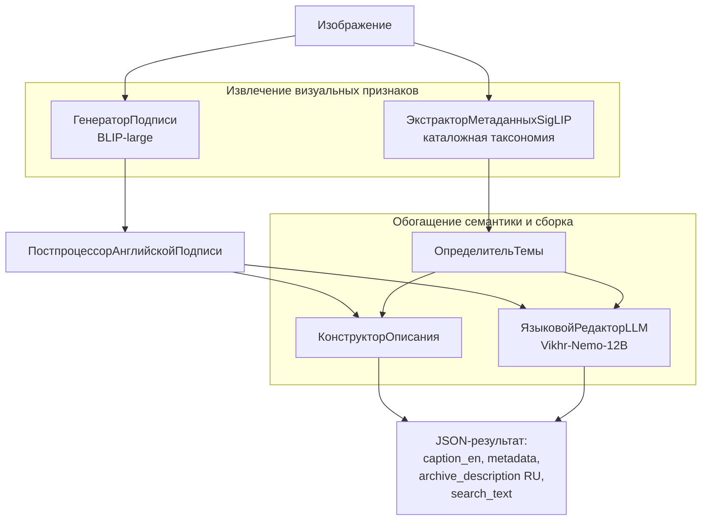
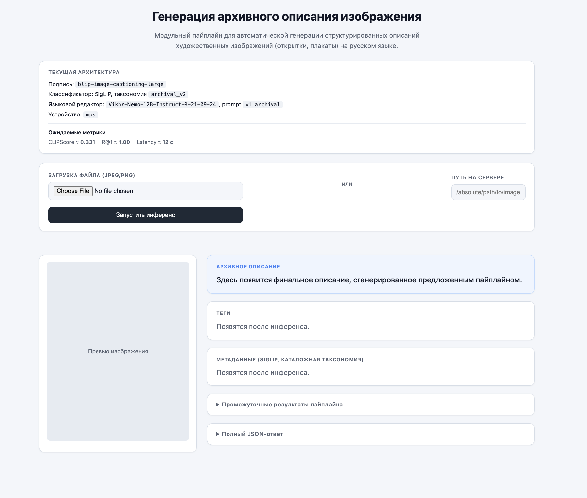
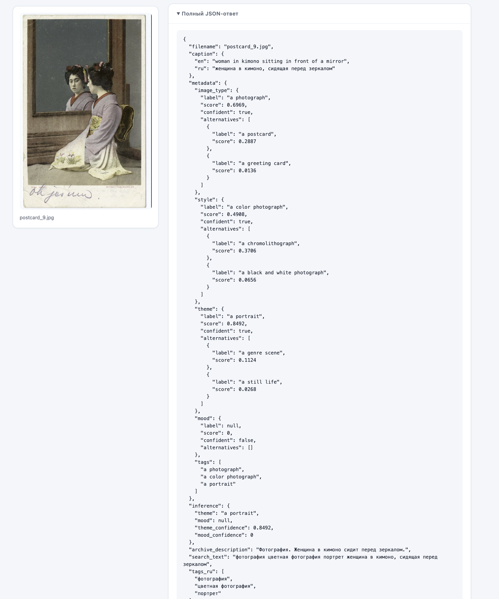

# Разработка интеллектуального программного обеспечения для генерации содержательного и семантического описания художественных изображений

ВКР, магистратура ТГУ, 2026
**Направление:** компьютерное зрение, vision-language модели

## Аннотация

В работе решается задача автоматической генерации структурированных архивных описаний на русском языке для художественных изображений из фондов цифровых библиотек (открытки и плакаты) с целью улучшения поиска и доступа к визуальным материалам.

Современные крупные сквозные мультимодальные модели (end-to-end vision-language), например, LLaVA, Qwen-VL и др., обеспечивают высокое качество генерируемых описаний, однако их применение в данной задаче ограничено: они требуют значительных вычислительных ресурсов, остаются мало интерпретируемыми (промежуточные семантические признаки скрыты), а их доменная адаптация ресурсоёмка и подвержена катастрофическому забыванию (catastrophic forgetting) общих знаний при переобучении на малом корпусе размеченных изображений. 

В данной работе предлагается модульное решение, в котором задача раскладывается на отдельные этапы, включая визуальное распознавание содержания, классификацию по архивной таксономии и стилистическую обработку текста. Каждый этап реализуется отдельным компонентом. Реализация упакована в Docker с обеспечением воспроизводимости запуска и валидирована на нескольких наборах данных, в том числе на размеченной коллекции [«Ленинград в Великой Отечественной войне 1941–1945 гг.: открытки»](https://rusneb.ru/collections/529_leningrad_v_velikoy_otechestvennoy_voyne_1941_1945_gg_otkrytki/) Российской Государственной Библиотеки.

Предложенный подход позволяет объединить интерпретируемость модульной архитектуры, пригодность для архивного поиска и возможность поэтапной адаптации отдельных компонентов без полной замены всей системы.

## Предлагаемая архитектура

Предлагаемая архитектура состоит из шести модулей. Каждый представляет собой замороженную предобученную модель или компонент на основе установленных правил (rule-based) с четко определенной функцией. Параметры отдельных компонентов могут быть адаптированы под конкретные задачи и сценарии использования внутри РГБ.

| # | Модуль                                                             | Модель / реализация | Особенности                                                                                                                         |
|---|--------------------------------------------------------------------|---|-------------------------------------------------------------------------------------------------------------------------------------|
| 1 | `ГенераторПодписи`/<br/>`CaptionGenerator`                         | BLIP-large (`Salesforce/blip-image-captioning-large`) | Английская подпись по изображению                                                                                                   |
| 2 | `ПостпроцессорАнглийскойПодписи`/<br/>`EnglishCaptionPostprocessor` | rule-based | Очистка артефактов BLIP (повторы, обрывы)                                                                                           |
| 3 | `ЭкстракторМетаданныхSigLIP`/<br/>`SigLIPMetadataExtractor`         | SigLIP-base (`google/siglip-base-patch16-224`) | Zero-shot классификация по категориям; каталожная таксономия на основе Файнштейн Э. Б. (1976), MARC 21, Getty AAT                   |
| 4 | `ОпределительТемы`/<br/>`ThemeInferencer`                               | rule-based | Агрегация полей; отбрасывает неуверенные и неоднозначные результаты классификации                                                   |
| 5 | `КонструкторОписания`/<br/>`DescriptionBuilder`                         | template-based | Поисковые теги и шаблонная заготовка описания                                                     |
| 6 | `ЯзыковойРедакторLLM`/<br/>`LLMRewriter`                                | Vikhr-Nemo-12B-Instruct-R | Генерация финального русского архивного описания по английской подписи + метаданным; собственная prompt-инструкция в архивном стиле |

Модульная организация архитектуры обеспечивает интерпретируемость и диагностируемость решения. Каждый этап формирует промежуточный результат, который может быть отдельно проанализирован: английская подпись, очищенная подпись, структурированные метаданные, поисковое представление и итоговое архивное описание. Это позволяет локализовать источники ошибок, сравнивать альтернативные конфигурации отдельных компонентов и выполнять поэтапную адаптацию системы без полной перестройки всего пайплайна.


```mermaid
flowchart TD
    IMG[Изображение]

    subgraph CV [Извлечение визуальных признаков]
        BLIP[ГенераторПодписи<br/>BLIP-large]
        SigLIP[ЭкстракторМетаданныхSigLIP<br/>каталожная таксономия]
    end

    ENPP[ПостпроцессорАнглийскойПодписи]

    subgraph SEM [Обогащение семантики и сборка]
        THEME[ОпределительТемы]
        BUILD[КонструкторОписания<br/>]
        LLM[ЯзыковойРедакторLLM<br/>Vikhr-Nemo-12B]
    end

    OUT[JSON-результат:<br/>caption_en, metadata,<br/>archive_description RU,<br/>search_text]

    IMG --> BLIP --> ENPP
    IMG --> SigLIP --> THEME
    ENPP --> BUILD
    THEME --> BUILD
    ENPP --> LLM
    THEME --> LLM
    BUILD --> OUT
    LLM --> OUT
```

## Оценки качества и производительности 

Рассматриваемая задача носит генеративный характер: для одного изображения возможно множество корректных описаний разной формы. Размеченных эталонных описаний для большинства изображений архивных фондов на данный момент нет; в отдельных тематических коллекциях разметка присутствует, но в ограниченном объёме. Поэтому основным инструментом оценки служит набор метрик, не требующих эталонных описаний (reference-free).

**Оценки качества:**

### `CLIPScore` (семантическое соответствие текста и изображения)

- Мера согласованности между текстовым описанием и изображением. Вычисляется как косинусное сходство их векторных представлений, полученных контрастивно-обученной мультимодальной моделью (CLIP / SigLIP / M-CLIP).
- Чем выше значение, тем описание семантически ближе к содержанию изображения; значения, близкие к нулю, указывают на слабую связь.

### `Cross-modal retrieval` (поисковая релевантность)

- Описание используется как поисковый запрос по пулу всех изображений набора; считается, насколько часто целевое изображение возвращается в топ-k результатов (R@1, R@5, R@10).
- Непосредственно отражает полезность описания как поискового признака: чем ближе R@1 к единице, тем выше шанс найти нужный документ по его автоматическому описанию.

**Оценка производительности:**

### Среднее время инференса (Latency)

- Среднее время обработки одного изображения, включая загрузку и все стадии пайплайна. Характеризует пригодность системы для обработки больших массивов изображений.

## Сводные метрики предложенного решения

Эталонный конфиг (BLIP-large без дообучения + SigLIP с каталожной таксономией + LLM-rewriter Vikhr-Nemo-12B) измерен на трёх независимых выборках. CLIPScore приведён в трёх вариантах для разных текстовых полей:

- **CLIPScore по английской подписи** — соответствие подписи (caption_en) изображению, измерено CLIP ViT-B-32 OpenAI.
- **CLIPScore по русской подписи** — то же для русского перевода подписи (caption_ru), измерено M-CLIP (XLM-Roberta-Large × ViT-B-32).
- **CLIPScore по архивному описанию** — соответствие финального описания (archive_description) изображению, M-CLIP.

| Выборка                                                  | n | CLIPScore (caption_en) | CLIPScore (caption_ru) | CLIPScore (archive RU) | t2i R@1 | t2i R@5 | Latency, сек |
|----------------------------------------------------------|---:|---:|---:|---:|---:|---:|---:|
| Малый семантический тестовый набор (открытки РГБ + NYPL) | 14 | 0.319 | 0.335 | 0.331 | 1.00 | 1.00 | 12.1 |
| Смешанный тестовый набор (РГБ + NYPL)                    | 60 | 0.301 | 0.312 | 0.319 | 0.70 | 0.97 | 19.4 |
| Коллекция №529 НЭБ с разметкой                           | 224 | 0.287 | 0.292 | 0.309 | 0.30 | 0.61 | 18.2 |

Размер пула для retrieval задачи возрастает от 14 до 224 (на больших пулах R@1 структурно ниже, так как задача значительно сложнее). Все CLIPScore вычислены на тех же изображениях, что и retrieval.

Полученные результаты показывают, что предложенное решение обеспечивает приемлемый баланс между качеством описания, поисковой релевантностью и вычислительной стоимостью. На малом тестовом наборе retrieval-метрики принимают очень высокие значения, тогда как на более крупных и разнородных выборках задача становится существенно сложнее, что проявляется в ожидаемом снижении R@1. При этом CLIPScore по архивному описанию остаётся устойчивым и подтверждает, что итоговое описание сохраняет семантическую связь с изображением.

## Экспериментальная валидация

Валидация предложенного решения организована как набор исследований по отдельным компонентам пайплайна. Все артефакты (JSON-результаты, контрольные точки обучения, конфигурации) воспроизводимы и сохранены в `data/eval/results/` и `models/`. Дополнительно результаты всех прогонов агрегируются в локальной таблице SQLite (`data/eval/experiments.db`) скриптом `scripts/exp_db.py`, что упрощает межэкспериментальные сравнения и интерактивный анализ в ноутбуках `notebooks/`.

Ниже представлено краткое резюме по каждой группе экспериментов. С подробным описанием (постановка, метод, конфигурация, выборка, таблицы численных результатов и качественный анализ) можно ознакомиться в [`docs/experiments.md`](docs/experiments.md).

### Выбор базовой модели генерации подписи

Сопоставлены две предобученные версии BLIP в идентичной обвязке остальной части пайплайна: `BLIP-base` (≈250 млн параметров) и `BLIP-large` (≈470 млн). На смешанной выборке (n=60) BLIP-large даёт лучшую поисковую релевантность (`t2i R@1` 0.68 -> 0.73, средняя позиция искомого изображения в списке 2.03 -> 1.92) при сопоставимом `CLIPScore`. Выбран `BLIP-large` как базовая модель подписи.

### Дообучение модели генерации подписи

Исследовано дообучение на трех открытых наборах изображений с подписями: `NYPL` (есть только небольшие заглавия, поэтому был применен подход `CapFilt` для формирования текстового корпуса, см. `docs/experiments.md`), `ArtCap` и `SemArt`. Дообучение производилось как с применением метода `LoRA`, так и в режиме полного fine-tuning.

`NYPL` и `ArtCap` снижают агрегированные метрики из-за смещения стиля подписей в сторону обучающего корпуса. Для `SemArt` результаты отличаются в зависимости от количества эпох обучения: эпоха 0 — единственная конфигурация, превзошедшая базовую модель по retrieval метрике (`t2i R@1` 0.73 --> 0.85), но качественный анализ показал ухудшение качества описаний из-за добавления топонимов из домена дообучающей выборки.

В основной конфигурации оставлена базовая `BLIP-large` без дообучения; дообучение перенесено в раздел будущей работы, т.к. необходим более крупный и тематически точный корпус (например, собственная подвыборка фондов РГБ).

### Выбор таксономии для классификации характеристик изображений 

Сравнены два варианта таксономии для классификации характеристик изображений. Для zero-shot модели `SigLIP` были протестированы начальная таксономия (разговорные категории, такие как «винтажный», «декоративный») и каталожная (Файнштейн Э. Б. (1976), MARC 21, Getty AAT). Каталожная снижает `CLIPScore` по архивному описанию на ≈0.02 (мультиязычный CLIP менее знаком с архивной лексикой), но улучшает поисковую релевантность (средняя позиция искомого изображения в списке 1.92 --> 1.85). 

Выбрана каталожная таксономия, т.к. поисковая релевантность является прямым показателем пользы для архивного применения, а описания, опирающиеся на признанные каталожные источники, удобнее интегрируются в существующие сценарии использования внутри РГБ.

### Способ сборки основного описания изображений 

Сравнены три способа сборки итогового русскоязычного описания: шаблонная сборка с переводом (`MarianMT` и `NLLB-200`, разница незначима; оставлен `MarianMT` как более лёгкая модель), языковая модель `Vikhr-Nemo-12B` по английской подписи и метаданным, а также альтернативная prompt-инструкция в стиле экспертных описаний РГБ. Языковая модель устраняет известные дефекты буквального перевода (полисемия, транслитерация имён собственных); альтернативная инструкция снижает `CLIPScore` на ≈0.03, но даёт более компактный стиль, схожий со стилем экспертных описаний из коллекций РГБ.

Языковая модель выбрана как основной способ генерации описания. Альтернативная prompt-инструкция сохранена как опция для пользовательских сценариев, ориентированных на стилистическую близость к конкретным типам описаний.

### Извлечение метаданных изображений с обучением линейного классификатора

Поверх замороженных визуальных представлений `SigLIP` обучен линейный классификатор и сопоставлен с zero-shot режимом на двух размеченных корпусах. На `SemArt` (5 классов сюжета, 15.8 тыс. полотен): точность 57.1 % (zero-shot) --> 89.5 % (классификатор). На коллекции РГБ "Ленинград в Великой Отечественной войне 1941–1945 гг.: открытки" (3 класса техники печати, 322 открытки): 88.7 % на отложенной выборке;

Узкое место zero-shot подхода - формулировки текстовых категорий, а не сам визуальный кодировщик. Признаки, извлеченные моделью `SigLIP`, уже содержат большую часть необходимой информации. В предложенном решении подготовлена возможность опционально подключить обученный классификатор для характеристик изображений, по которым доступны размеченные данные, без перестройки самого пайплайна.

### Валидация качества сгенерированных описаний на коллекции с экспертной разметкой

На 224 открытках коллекции РГБ «Ленинград в Великой Отечественной войне» измерены текстовые метрики, для которых необходимо эталонное описание - `BERTScore_RU`, `chrF`, `ROUGE-L`, `BLEU`. Основная конфигурация пайплайна: `BERTScore_RU` 0.658, `ROUGE-L` 0.104, `chrF` 14.6; альтернативный prompt для компонента `ЯзыковойРедакторLLM` - `BERTScore_RU` 0.663, `ROUGE-L` 0.129. Качественный анализ показал, что основное расхождение с экспертными описаниями объясняется отсутствием в пайплайне модуля распознавания именованных сущностей (географические названия, знаковые городские места, исторические лица, военная атрибутика, и пр.). Именно это является фундаментальным пределом метода в текущей архитектуре. 

Дополнительная валидация подтверждает, что метрики, не требующие эталонного описания (CLIPScore, retrieval), направленно коррелируют с экспертным восприятием. Применение таких метрик остаётся основным методом оценки качества сгенерированных описаний, поскольку размеченных коллекций недостаточно для полностью supervised режима, тогда как метрики без разметки применимы ко всему фонду.

## Технический контекст

### Установка

```bash
git clone https://github.com/azat-khatyn/tsu-image-description.git
cd tsu-image-description
pip install --upgrade pip
pip install -r requirements.txt
```

### Локальный запуск API

```bash
uvicorn app.api.main:app --reload
```

Сервис доступен по адресу `http://127.0.0.1:8000`. Endpoints:

- `GET /health` — проверка состояния
- `POST /inference` — инференс на одном изображении (файл или путь)

Пример:

```bash
curl -X POST "http://127.0.0.1:8000/inference" -F "file=@/path/to/image.jpg"
```

### Контейнеризация

Полный пайплайн упакован в Docker-образ. Конфигурация включает `Dockerfile` и `docker-compose.yml`. Запуск одной командой:

```bash
docker compose up --build
```

После старта UI доступен на `http://localhost:8000`. Локальные изображения монтируются из `./mounted_data/` (хост) в `/mounted_data/` (контейнер). Веса моделей кэшируются в именованном volume `hf_cache` и сохраняются между пересборками образа.

**Состав образа:** Python 3.12-slim; PyTorch CPU-сборка для переносимости (на машинах с GPU локальный запуск ускоряет инференс в 5–10 раз); набор библиотек зафиксирован в `requirements.docker.txt`. Healthcheck опрашивает endpoint `/health`; `start_period=120` сек даёт пайплайну прогрузить веса при первом старте.

Языковой редактор в Docker-конфигурации отключён по умолчанию (`USE_LLM_REWRITER=false` в `docker-compose.yml`): CPU-инференс Vikhr-Nemo-12B нецелесообразен по latency и требует ~32 ГБ RAM, тогда как остальная часть пайплайна укладывается в 8 ГБ. Включить редактор можно явным переопределением переменнойп:

```bash
USE_LLM_REWRITER=true docker compose up
```

### Запуск из командной строки

Запуск пайплайна на одном изображении для получения JSON с описанием, тегами и метаданными:

```bash
PYTHONPATH=src python scripts/run_demo.py --image data/eval/images/postcard_1.jpg
```

### Воспроизводимость

Скрипты для воспроизведения экспериментов находятся в `scripts/`. Предусмотрены  `--help` с описанием флагов. Их параметры подробно разобраны в [docs/experiments.md](docs/experiments.md).

Каждый эксперимент сохраняется как JSON с полем `summary.config`, содержащим версию таксономии, модели, гиперпараметры и флаги CLI. 

Дополнительно для каждого запуска сохраняются итоговые текстовые артефакты, что позволяет сопоставлять агрегатные метрики с содержанием конкретных сгенерированных описаний и проводить как количественный, так и качественный сравнительный анализ.

## Структура проекта

```text
tsu-image-description/
├── app/                              # FastAPI приложение (API + UI)
├── src/tsu_image_description/        # библиотека (pipeline и компоненты)
│   ├── pipeline.py
│   ├── models.py                     # CaptionGenerator (BLIP)
│   ├── english_caption_postprocessor.py
│   ├── siglip_metadata_extractor.py  # zero-shot classifier (versioned taxonomy)
│   ├── theme_inference.py
│   ├── description_builder.py        # search_text + опорный шаблон
│   ├── llm_rewriter.py               # Vikhr-Nemo: финальное русское описание
│   └── text_postprocessor.py
├── scripts/
│   ├── evaluate.py                   # основная оценка
│   ├── eval_reference_based.py       # BERTScore_RU + chrF + ROUGE-L + BLEU
│   ├── eval_stats.py                 # bootstrap CI + paired test
│   ├── run_demo.py
│   ├── preload_models.py
│   ├── exp_db.py
│   ├── data_preparation/             # подготовка датасетов (NEB scrape, SemArt/ArtCap prep, NYPL CapFilt)
│   ├── training/                     # LoRA / полное дообучение BLIP
│   └── benchmarks/                   # бенчмарки и probe-эксперименты SigLIP
├── data/
│   ├── eval/                         # эталонные наборы + результаты
│   ├── semart/                       # бенчмарк + признаки для probe
│   ├── neb_leningrad_wwii/           # размеченная коллекция №529
│   ├── artcap/                       # ArtCap для эксперимента BLIP-LoRA
│   └── nypl/                         # NYPL training data
├── notebooks/                        # анализ embedding'ов и результатов
├── docs/experiments.md               # подробный журнал экспериментов
├── demo/screenshots/
├── requirements.txt
├── requirements.docker.txt
├── docker-compose.yml
└── Dockerfile
```

## Ограничения метода

Предлагаемое решение имеет ряд ограничений. Во-первых, система в текущем виде не содержит специализированного модуля распознавания именованных сущностей, поэтому не восстанавливает названия географических объектов, зданий, исторических лиц и других сущностей, которые могут присутствовать в экспертных каталогизаторских описаниях. Во-вторых, качество итогового описания зависит от точности базовой английской подписи: ошибки генерации на раннем этапе могут распространяться дальше по пайплайну. В-третьих, используемые метрики, не требующие эталонных описаний, хорошо отражают общую семантическую связь текста и изображения, однако не всегда чувствительны к ошибкам на уровне отдельных объектов и сущностей. Наконец, при использовании внешних корпусов для дообучения возникает риск смещения распределения модели в сторону домена обучающих данных, что особенно критично для архивных изображений, где фактологическая точность описания имеет первостепенное значение.

## Дальнейшая работа

1. **Дообучение на собственном корпусе РГБ.** Сбор и разметка более крупного и тематически релевантного корпуса (советская, дореволюционная, и пр.) с последующим LoRA-дообучением - один из наиболее перспективных путей повышения качества на специфически российских сюжетах.

2. **Интеграция supervised-классификатора в основной пайплайн.** Добавить опциональный режим экстрактора метаданных, использующий обученный линейный классификатор поверх замороженных SigLIP-признаков для тех характеристик изображений, по которым имеются размеченные данные.

3. **Распознавание именованных сущностей и текста на изображении.** Перспективными направлениями являются интеграция OCR, NER и специализированных prompt-based методов уточнения описаний в мультимодальных моделях.

## Демонстрация

### Интерфейс сервиса


### Результат инференса


### JSON-ответ

