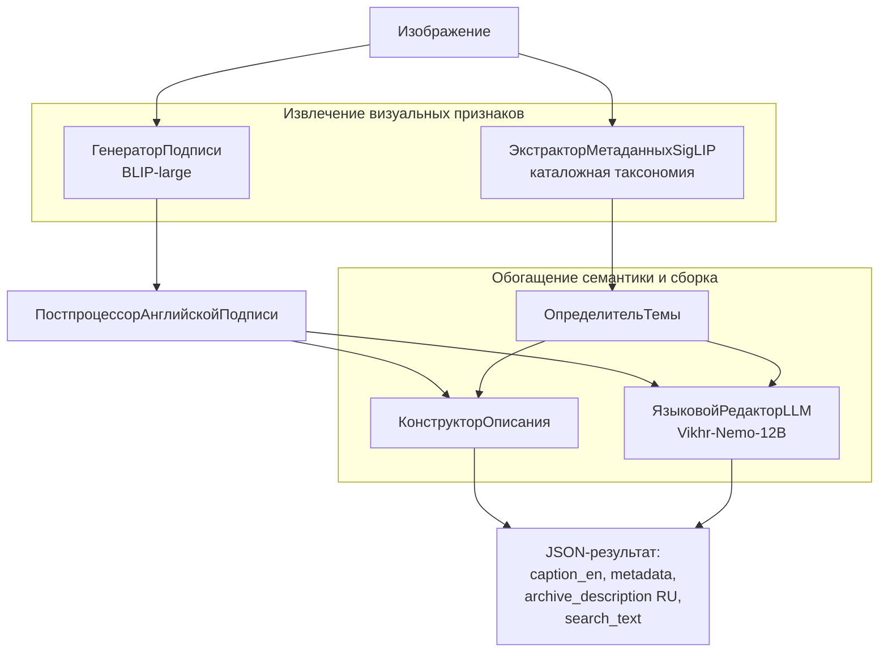

# Разработка интеллектуального программного обеспечения для генерации содержательного и семантического описания художественных изображений

ВКР, магистратура ТГУ, 2026
**Направление:** компьютерное зрение, vision-language модели

## Аннотация

В работе решается задача автоматической генерации структурированных архивных описаний на русском языке для художественных изображений из фондов цифровых библиотек (открытки и плакаты) с целью улучшения поиска и доступа к визуальным материалам.

Современные крупные сквозные мультимодальные модели (end-to-end vision-language), например, LLaVA, Qwen-VL и др., обеспечивают высокое качество генерируемых описаний, однако их применение в данной задаче ограничено: они требуют значительных вычислительных ресурсов, остаются мало интерпретируемыми (промежуточные семантические признаки скрыты), а их доменная адаптация ресурсоёмка и подвержена катастрофическому забыванию (catastrophic forgetting) общих знаний при переобучении на малом корпусе размеченных изображений. 

В данной работе предлагается модульное решение, в котором задача раскладывается на отдельные этапы, включая визуальное распознавание содержания, классификацию по архивной таксономии и стилистическую обработку текста. Каждый этап реализуется отдельным компонентом. Реализация упакована в Docker с обеспечением воспроизводимости запуска и валидирована на нескольких наборах данных, в том числе на размеченной коллекции [«Ленинград в Великой Отечественной войне 1941–1945 гг.: открытки»](https://rusneb.ru/collections/529_leningrad_v_velikoy_otechestvennoy_voyne_1941_1945_gg_otkrytki/) Российской Государственной Библиотеки.

Предложенный подход позволяет объединить интерпретируемость модульной архитектуры, пригодность для архивного поиска и возможность поэтапной адаптации отдельных компонентов без полной замены всей системы.

## Предлагаемая архитектура

Предлагаемая архитектура состоит из шести модулей. Каждый представляет собой замороженную предобученную модель или компонент на основе установленных правил (rule-based) с четко определенной функцией. Параметры отдельных компонентов могут быть адаптированы под конкретные задачи и сценарии использования внутри РГБ.

| # | Модуль                                                             | Модель / реализация | Особенности                                                                                                                         |
|---|--------------------------------------------------------------------|---|-------------------------------------------------------------------------------------------------------------------------------------|
| 1 | `ГенераторПодписи`/<br/>`CaptionGenerator`                         | BLIP-large (`Salesforce/blip-image-captioning-large`) | Английская подпись по изображению                                                                                                   |
| 2 | `ПостпроцессорАнглийскойПодписи`/<br/>`EnglishCaptionPostprocessor` | rule-based | Очистка артефактов BLIP (повторы, обрывы)                                                                                           |
| 3 | `ЭкстракторМетаданныхSigLIP`/<br/>`SigLIPMetadataExtractor`         | SigLIP-base (`google/siglip-base-patch16-224`) | Zero-shot классификация по категориям; каталожная таксономия на основе Файнштейн Э. Б. (1976), MARC 21, Getty AAT                   |
| 4 | `ОпределительТемы`/<br/>`ThemeInferencer`                               | rule-based | Агрегация полей; отбрасывает неуверенные и неоднозначные результаты классификации                                                   |
| 5 | `КонструкторОписания`/<br/>`DescriptionBuilder`                         | template-based | Поисковые теги и шаблонная заготовка описания                                                     |
| 6 | `ЯзыковойРедакторLLM`/<br/>`LLMRewriter`                                | Vikhr-Nemo-12B-Instruct-R | Генерация финального русского архивного описания по английской подписи + метаданным; собственная prompt-инструкция в архивном стиле |

Модульная организация архитектуры обеспечивает интерпретируемость и диагностируемость решения. Каждый этап формирует промежуточный результат, который может быть отдельно проанализирован: английская подпись, очищенная подпись, структурированные метаданные, поисковое представление и итоговое архивное описание. Это позволяет локализовать источники ошибок, сравнивать альтернативные конфигурации отдельных компонентов и выполнять поэтапную адаптацию системы без полной перестройки всего пайплайна.


```mermaid
flowchart TD
    IMG[Изображение]

    subgraph CV [Извлечение визуальных признаков]
        BLIP[ГенераторПодписи<br/>BLIP-large]
        SigLIP[ЭкстракторМетаданныхSigLIP<br/>каталожная таксономия]
    end

    ENPP[ПостпроцессорАнглийскойПодписи]

    subgraph SEM [Обогащение семантики и сборка]
        THEME[ОпределительТемы]
        BUILD[КонструкторОписания<br/>]
        LLM[ЯзыковойРедакторLLM<br/>Vikhr-Nemo-12B]
    end

    OUT[JSON-результат:<br/>caption_en, metadata,<br/>archive_description RU,<br/>search_text]

    IMG --> BLIP --> ENPP
    IMG --> SigLIP --> THEME
    ENPP --> BUILD
    THEME --> BUILD
    ENPP --> LLM
    THEME --> LLM
    BUILD --> OUT
    LLM --> OUT
```

Результатом работы пайплайна являются два текстовых представления изображения. Поле `archive_description` предназначено для отображения в пользовательском интерфейсе и использования в качестве связного архивного описания на русском языке. Поле `search_text` представляет собой поисковое представление, включающее наиболее информативные признаки изображения и предназначенное для задач индексирования и cross-modal retrieval. Такое разделение позволяет независимо оптимизировать удобочитаемость описания для человека и его полезность как поискового признака.

## Оценки качества и производительности 

Рассматриваемая задача носит генеративный характер: для одного изображения возможно множество корректных описаний разной формы. Размеченных эталонных описаний для большинства изображений архивных фондов на данный момент нет; в отдельных тематических коллекциях разметка присутствует, но в ограниченном объёме. Поэтому основным инструментом оценки служит набор метрик, не требующих эталонных описаний (reference-free).

**Оценки качества:**

### `CLIPScore` (семантическое соответствие текста и изображения)

- Мера согласованности между текстовым описанием и изображением. Вычисляется как косинусное сходство их векторных представлений, полученных контрастивно-обученной мультимодальной моделью (CLIP / SigLIP / M-CLIP).
- Чем выше значение, тем описание семантически ближе к содержанию изображения; значения, близкие к нулю, указывают на слабую связь.

### `Cross-modal retrieval` (поисковая релевантность)

- Описание используется как поисковый запрос по пулу всех изображений набора; считается, насколько часто целевое изображение возвращается в топ-k результатов (R@1, R@5, R@10).
- Непосредственно отражает полезность описания как поискового признака: чем ближе R@1 к единице, тем выше шанс найти нужный документ по его автоматическому описанию.

**Оценка производительности:**

### Среднее время инференса (Latency)

- Среднее время обработки одного изображения, включая загрузку и все стадии пайплайна. Характеризует пригодность системы для обработки больших массивов изображений.

## Сводные метрики предложенного решения

Эталонный конфиг (BLIP-large без дообучения + SigLIP с каталожной таксономией + LLM-rewriter Vikhr-Nemo-12B) измерен на трёх независимых выборках. CLIPScore приведён в трёх вариантах для разных текстовых полей:

- **CLIPScore по английской подписи** — соответствие подписи (caption_en) изображению, измерено CLIP ViT-B-32 OpenAI.
- **CLIPScore по русской подписи** — то же для русского перевода подписи (caption_ru), измерено M-CLIP (XLM-Roberta-Large × ViT-B-32).
- **CLIPScore по архивному описанию** — соответствие финального описания (archive_description) изображению, M-CLIP.

| Выборка                                                  | n | CLIPScore (caption_en) | CLIPScore (caption_ru) | CLIPScore (archive RU) | t2i R@1 | t2i R@5 | Latency, сек |
|----------------------------------------------------------|---:|---:|---:|---:|---:|---:|---:|
| Малый семантический тестовый набор (открытки РГБ + NYPL) | 14 | 0.319 | 0.335 | 0.331 | 1.00 | 1.00 | 12.1 |
| Смешанный тестовый набор (РГБ + NYPL)                    | 60 | 0.301 | 0.312 | 0.319 | 0.70 | 0.97 | 19.4 |
| Коллекция №529 НЭБ с разметкой                           | 224 | 0.287 | 0.292 | 0.309 | 0.30 | 0.61 | 18.2 |

Размер пула для retrieval задачи возрастает от 14 до 224 (на больших пулах R@1 структурно ниже, так как задача значительно сложнее). Все CLIPScore вычислены на тех же изображениях, что и retrieval.

Полученные результаты показывают, что предложенное решение обеспечивает приемлемый баланс между качеством описания, поисковой релевантностью и вычислительной стоимостью. На малом тестовом наборе retrieval-метрики принимают очень высокие значения, тогда как на более крупных и разнородных выборках задача становится существенно сложнее, что проявляется в ожидаемом снижении R@1. При этом CLIPScore по архивному описанию остаётся устойчивым и подтверждает, что итоговое описание сохраняет семантическую связь с изображением.

## Экспериментальная валидация

Экспериментальная валидация предложенного решения была организована как серия взаимосвязанных исследований, направленных на проверку отдельных компонентов пайплайна и их влияния на итоговое качество описания. Рассматривались как генеративные компоненты системы, так и качество таксономии классификатора, способы формирования итогового описания, а также возможность замены zero-shot классификации на supervised-подход поверх замороженных визуальных признаков. Все артефакты экспериментов (JSON-результаты, чекпоинты дообучения, конфигурации) воспроизводимы и сохранены в `data/eval/results/` и `models/`.

Дополнительно результаты всех прогонов агрегируются в локальной таблице SQLite (`data/eval/experiments.db`). Скрипт `scripts/exp_db.py` загружает в неё JSON-артефакты экспериментов: метрики по каждой выборке (CLIPScore, retrieval R@k, latency) и конфигурацию запуска. Это упрощает межэкспериментальные сравнения и сравнительный анализ.

### Дообучение моделей

Проверялись возможности повышения качества генерации описаний за счёт дообучения модели BLIP-large на трёх доступных корпусах изображений с подписями: `NYPL` (≈6.6 тыс. открыток из открытого архива Нью-Йоркской публичной библиотеки), `ArtCap` (≈4 тыс. пар «изображение–подпись» о произведениях искусства) и `SemArt` (≈8 тыс. пар после фильтрации до коротких описаний визуального содержания из ≈19 тыс. художественных полотен).

Целью этих экспериментов было определить, может ли доменная адаптация генеративной модели улучшить качество описаний изображений архивного типа без существенного роста галлюцинаций и смещения распределения в сторону обучающего корпуса. Особое внимание уделялось не только агрегатным метрикам, но и качественному анализу содержания сгенерированных описаний.

Основные наблюдения:

- **Дообучение на NYPL:** - ближайшему по жанру к поставленной РГБ задаче открытому корпусу открыток. Экспертных описаний для NYPL нет, поэтому обучающие пары собирались по схеме CapFilt: BLIP-base сам генерировал подписи к изображениям, CLIP-фильтр отсеивал слабые пары, а в финальный обучающий набор включалась гибридная строка `подпись + " . " + название записи NYPL`. Проверены и полное дообучение, и LoRA (r=16) в нескольких конфигурациях. Главное ограничение, проявившееся на анализе качества генерации: конкатенация каталожных названий NYPL в каждую обучающую подпись смещает модель в сторону лексики и стиля метаданных NYPL («trade card», «greeting card», «the walter baker co.»), а не описаний предметной области. Эксперимент послужил мотивацией для перехода к корпусам с более чистыми подписями.
- **Дообучение на ArtCap** даёт стабильное снижение всех проверяемых метрик относительно базовой модели, даже с консервативными гиперпараметрами (низкая learning rate, высокий dropout, одна эпоха). Конкретно, подписи смещаются в сторону определения стилистики изображения (например, «painting by ...», «artwork in the style of ...»), теряется способность описывать общие категории.
- **Дообучение на SemArt** с теми же мягкими гиперпараметрами впервые превысило базовую модель по retrieval-метрике (R@1 на смешанной выборке поднялся с 0.73 до 0.85) и по CLIPScore по подписи. Однако при сравнении эпох 0 / 1 / 2 чётко видна точка перелома: после первой эпохи downstream-метрики деградируют, хотя ошибка на валидационной выборке SemArt продолжает падать.  Анализ качества сгенерированных описаний показывает побочный эффект — лучший вариант дообученной на данных SemArt модели (epoch 0) генерирует конкретные топонимы и атрибуты, которые не являются частью изображения (например, изображению русского города приписывается несуществующий западноевропейский храм). Это делает дообученный вариант непригодным как решения описательной задачи для архивов, где фактологическая точность критична.

С подробным описанием экспериментов по дообучению модели BLIP на разных наборах данных можно ознакомиться в разделе `docs/experiments.md`.

**Главный вывод.** Дообучение показывает работоспособность подхода, однако при использовании наборов данных, рассмотренных в рамках данной работы, происходит сдвиг распределения весов модели в сторону домена обучающих данных, которые только частично соответствуют специфике решаемой задачи. При получении более крупного и тематически релевантного корпуса (например, собственная размеченная подвыборка фондов РГБ, содержащая экспертное описание изображений из советской, дореволюционной, и пр. тематики) дообучение становится очень перспективным направлением, особенно для повышения детализации описаний на специфически российских сюжетах, которые не представлены в общих англоязычных корпусах.

### Таксономия классификатора

Для рассматриваемой задачи выбор таксономии влияет не только на интерпретируемость промежуточных предсказаний, но и на пригодность итогового описания для архивного поиска. Разговорные категории могут быть интуитивно понятнее модели, однако они хуже согласуются с библиотечными и архивными классификациями. Напротив, каталожные термины могут быть менее привычны для мультимодальных моделей, но лучше соответствуют практикам индексирования и описания фондов.

Сравнивались две версии таксономии для zero-shot SigLIP-классификатора:

- **Начальная**: разговорные категории первого приближения («винтажный», «декоративный», «ретро»), не привязанные к признанным стандартам каталогизации.
- **Каталожная**: категории, согласованные с источниками: Файнштейн Э. Б. «В мире открытки» (1976), MARC 21 поле 655, Getty AAT (Print processes / Subjects).

Каталожная таксономия снижает CLIPScore по архивному описанию примерно на 0.02 (мультиязычный CLIP менее знаком с такими терминами как «хромолитография», «офорт», чем с разговорным «винтажная открытка»), но улучшает поисковую релевантность: средняя позиция целевого изображения в выдаче (когда описание используется как поисковый запрос) снижается с 1.92 до 1.85 — чем меньше число, тем выше изображение в результатах поиска.

**Главный вывод.** Каталожная таксономия является уместным выбором для архивного применения: cross-modal retrieval является прямым показателем полезности для поиска, тогда как CLIPScore чувствителен к лексическому распределению обучающих данных мультиязычного CLIP. Кроме того, описания, опирающиеся на признанные каталожные источники, удобнее интегрируются в существующие системы классификаций.

### Способ генерации финального описания

Проверялись три способа сборки финального русского архивного описания:

- **Шаблонная сборка с прямым переводом**: таблица соответствий «метаданные классификатора → русское слово», подставляемая в шаблон; русская подпись получается машинным переводом английской.
- **Языковая модель в основной конфигурации**: Vikhr-Nemo-12B получает на вход английскую подпись + структурированные метаданные и пишет связное русское архивное описание в одном шаге, минуя промежуточный буквальный перевод.
- **Альтернативная prompt-инструкция**: та же языковая модель с переписанной инструкцией: убрана преамбула типа материала, выход в стиле «Примечание содержания» РНБ (именные и причастные конструкции).

#### Выбор модели машинного перевода для шаблонной сборки

В рамках первого способа сборки сопоставлены две модели машинного перевода английского описания на русский:

- `MarianMT` (`Helsinki-NLP/opus-mt-en-ru`) — специализированная пара EN→RU, ≈300 млн параметров.
- `NLLB-200` (`facebook/nllb-200-distilled-600M`) — мультиязычная модель Meta (200 языков), ≈600 млн параметров.

Заметной разницы по рассматриваемым метрикам и при качественной проверке переводов сгенерированных описаний между ними не обнаружено. В шаблонной сборке оставлен `MarianMT` как более лёгкая и быстрая модель (примерно в два раза меньше по числу параметров, быстрее на инференсе).

#### Сравнение шаблонной сборки и языковой модели

Языковая модель устраняет известные дефекты буквального перевода (полисемия «painting» → «картина» / «покраска», транслитерация имён собственных вместо ботанических терминов «Holly» / «остролист») и даёт грамматически естественные описания. Альтернативная prompt-инструкция приводит описание к более компактному стилю, но снижает CLIPScore по архивному описанию на ≈0.03 — преамбула с указанием техники помогала мультиязычному CLIP связать описание с изображением.

**Главный вывод.** Языковую модель как редактор поверх метаданных классификатора можно рассматривать как основной способ генерации связного описания изображения в предложенном решении; prompt-инструкция допускает изолированную настройку стиля без переобучения. Альтернативная экспертная инструкция сохраняется как опция для пользовательских сценариев, где приоритет — стилистическая близость к каталогизатору, а не семантическая близость по CLIPScore.

Таким образом, выбор способа формирования итогового описания определяется компромиссом между естественностью текста, его стилистической близостью к экспертному описанию и степенью семантической близости к изображению, измеряемой автоматически. В контексте архивного применения этот компромисс особенно важен, поскольку описание должно быть одновременно полезным для пользователя и пригодным для поиска.

### Извлечение метаданных с обучением классификатора

Базовая конфигурация решения использует SigLIP в режиме без обучения (zero-shot): классификатор сопоставляет изображение со списком текстовых категорий и выбирает наиболее близкую. Оставался открытым вопрос: что именно ограничивает качество классификации — выбранные текстовые формулировки категорий или сами визуальные представления, которые SigLIP вычисляет для изображения. Чтобы это проверить, поверх тех же замороженных визуальных представлений обучен лёгкий линейный классификатор (один матричный слой, быстрое обучение). Если выбор категорий ограничивает результат, обученный классификатор должен заметно превзойти zero-shot подход; если ограничены сами визуальные представления — заметной разницы не будет.

Эксперимент проведён на двух размеченных корпусах:

- **SemArt** (≈15.8 тыс. полотен с экспертно проставленным сюжетом, 5 классов): точность поднимается с 57.1 % (zero-shot) до **89.5 %** (обученный классификатор) на отложенной выборке — рост на 32 процентных пункта на тех же визуальных представлениях.
- **Размеченная коллекция открыток №529 РГБ** (322 шт. с указанной техникой печати): обученный классификатор различает три класса (литография / автотипия / цинкография) с точностью **88.7 %** на отложенной выборке. Проверка на открытках другого домена (смешанная выборка РГБ + NYPL) подтверждает работоспособность подхода: предсказания распределены осмысленно, классификатор не сваливается в один доминирующий класс.

**Главный вывод.** Узкое место zero-shot подхода — формулировки текстовых категорий, а не сам визуальный кодировщик: визуальные представления SigLIP уже содержат большую часть информации, необходимой для каталожной классификации. Архитектурно подготовлена возможность опционально подключить обученный классификатор для тех осей (тип материала, техника печати), где доступны размеченные данные, без перестройки основной части пайплайна.

Практическое значение этого результата состоит в том, что дальнейшее улучшение системы может быть достигнуто не только за счёт замены мультимодальной модели целиком, но и за счёт обучения лёгких специализированных классификаторов поверх уже имеющихся визуальных представлений. Это делает архитектуру расширяемой и позволяет улучшать отдельные оси классификации по мере появления размеченных данных.

### Валидация на коллекции с экспертной разметкой

В Российской Государственной Библиотеке опубликована коллекция «Ленинград в Великой Отечественной войне 1941–1945 гг. (открытки)» — 324 открытки, для большинства которых заполнены поля «Вариант заглавия» (RUSMARC 540) и «Примечание содержания» (RUSMARC 327) с экспертными описаниями визуального содержания. Этот источник использован как дополнительный supervised-сигнал для проверки гипотезы, что reference-free метрики коррелируют с восприятием эксперта-каталогизатора.

После фильтрации к 224 открыткам с полноценным экспертным описанием сгенерированы автоматические описания на основе предложенного решения; сравнение проведено по BERTScore_RU (семантическая близость на уровне эмбеддингов мультиязычного BERT), chrF (character-level сходство, толерантнее к морфологии русского языка), ROUGE-L и BLEU.

Описания были сгенерированы как в базовой конфигурации, так и с адаптацией запроса (prompt) под стиль имеющихся экспертных описаний.

Данная валидация не заменяет reference-free оценку, а дополняет её. Её задача состоит в том, чтобы проверить, насколько автоматически вычисляемые сигналы качества соотносятся с оценкой описаний по отношению к экспертно подготовленным текстам в реальной библиотечной коллекции.

Результаты:

| Конфигурация                                               | BERTScore_RU | ROUGE-L | chrF |
|------------------------------------------------------------|---:|---:|---:|
| Основная (LLM-rewriter с архивной преамбулой)              | 0.658 | 0.104 | 14.6 |
| Альтернативная (LLM-rewriter в стиле экспертного описания) | 0.663 | 0.129 | 10.0 |

Качественный анализ лучших и худших по ранжированию метрик примеров показал, что основное расхождение с экспертными описаниями объясняется отсутствием в пайплайне модуля распознавания именованных сущностей (Named Entities), таких как специфические названия географических мест, городских строений, исторических лиц, военной атрибутики и пр.). Этот разрыв определяет фундаментальный предел метода в текущем решении и обозначен как направление будущей работы.

**Главный вывод.** Дополнительная валидация на эталонных экспертных описаниях подтверждает, что reference-free сигналы (CLIPScore, retrieval) направленно коррелируют с экспертным восприятием. При этом основным методом оценки остаётся вычисление метрик на наборах данных без эталонных описаний: размеченных коллекций архивного масштаба недостаточно для полностью supervised режима оценки, тогда как метрики, не требующие разметки, применимы ко всему фонду.

## Технический контекст

### Установка

```bash
git clone <repo_url>
cd tsu-image-description
pip install --upgrade pip
pip install -r requirements.txt
```

### Локальный запуск API

```bash
uvicorn app.api.main:app --reload
```

Сервис доступен по адресу `http://127.0.0.1:8000`. Endpoints:

- `GET /health` — проверка состояния
- `POST /inference` — инференс на одном изображении (файл или путь)

Пример:

```bash
curl -X POST "http://127.0.0.1:8000/inference" -F "file=@/path/to/image.jpg"
```

### Контейнеризация

Полный пайплайн упакован в Docker-образ; конфигурация — `Dockerfile` + `docker-compose.yml`. Однокомандный запуск:

```bash
docker compose up --build
```

После старта UI доступен на `http://localhost:8000`. Локальные изображения монтируются через `./mounted_data/` → `/mounted_data/`. Веса моделей кэшируются в именованном volume `hf_cache` и не перекачиваются при пересборке.

**Состав образа:** Python 3.12-slim; PyTorch CPU-сборка для переносимости (на машинах с GPU локальный запуск ускоряет инференс в 5–10 раз); набор библиотек зафиксирован в `requirements.docker.txt`. Healthcheck — на endpoint `/health` (start_period 120 сек на загрузку моделей).

**Ресурсные требования:** минимум 8 ГБ RAM без языкового редактора; 32 ГБ для конфигурации с Vikhr-Nemo-12B в fp16 (по умолчанию языковой редактор в Docker-конфигурации отключён, так как CPU-инференс 12B-модели нецелесообразен по латентности).

### Запуск экспериментов из CLI

```bash
# Инференс на одном изображении
PYTHONPATH=src python scripts/run_demo.py --image data/eval/images/postcard_1.jpg

# Полная оценка на собственном эталонном наборе
PYTHONPATH=src python scripts/evaluate.py \
  --references data/eval/references.jsonl \
  --use-llm-rewriter \
  --taxonomy-version archival_v2 \
  --output data/eval/results/metrics_run.json

# Reference-based метрики против curator-разметки
PYTHONPATH=src python scripts/eval_reference_based.py \
  --input data/eval/results/metrics_run.json \
  --output data/eval/results/refbased_run.json \
  --fields archive_ru,caption_ru

# Сбор открыток с curator-описаниями из НЭБ
python scripts/data/scrape_neb_collection.py \
  --output-dir data/neb_leningrad_wwii --delay 1.0
```

### Воспроизводимость

Каждый эксперимент сохраняется как JSON с полем `summary.config`, содержащим версию таксономии, модели, гиперпараметры и флаги CLI. Этого достаточно для точного восстановления любой ранее проведённой конфигурации.

Дополнительно для каждого запуска сохраняются итоговые текстовые артефакты, что позволяет сопоставлять агрегатные метрики с содержанием конкретных сгенерированных описаний и проводить как количественный, так и качественный сравнительный анализ.

## Структура проекта

```text
tsu-image-description/
├── app/                              # FastAPI приложение (API + UI)
├── src/tsu_image_description/        # библиотека (pipeline и компоненты)
│   ├── pipeline.py
│   ├── models.py                     # CaptionGenerator (BLIP)
│   ├── english_caption_postprocessor.py
│   ├── siglip_metadata_extractor.py  # zero-shot classifier (versioned taxonomy)
│   ├── theme_inference.py
│   ├── description_builder.py        # search_text + опорный шаблон
│   ├── llm_rewriter.py               # Vikhr-Nemo: финальное русское описание
│   └── text_postprocessor.py
├── scripts/
│   ├── evaluate.py                   # основная оценка
│   ├── eval_reference_based.py       # BERTScore_RU + chrF + ROUGE-L + BLEU
│   ├── eval_stats.py                 # bootstrap CI + paired test
│   ├── llm_judge.py                  # LLM-as-judge
│   ├── run_demo.py
│   ├── preload_models.py
│   ├── exp_db.py
│   ├── data/                         # ingestion / sampling
│   ├── probes/                       # supervised SigLIP-эксперименты
│   └── _legacy/                      # архив воспроизводимости
├── data/
│   ├── eval/                         # эталонные наборы + результаты
│   ├── semart/                       # бенчмарк + признаки для probe
│   ├── neb_leningrad_wwii/           # размеченная коллекция №529
│   └── nypl/                         # NYPL training data
├── notebooks/                        # анализ embedding'ов и результатов
├── docs/                             # лог экспериментов, рубрики, планы
├── demo/screenshots/
├── requirements.txt
├── requirements.docker.txt
├── docker-compose.yml
└── Dockerfile
```

## Ограничения метода

Предлагаемое решение имеет ряд ограничений. Во-первых, система в текущем виде не содержит специализированного модуля распознавания именованных сущностей, поэтому не восстанавливает названия географических объектов, зданий, исторических лиц и других сущностей, которые могут присутствовать в экспертных каталогизаторских описаниях. Во-вторых, качество итогового описания зависит от точности базовой английской подписи: ошибки генерации на раннем этапе могут распространяться дальше по пайплайну. В-третьих, используемые метрики, не требующие эталонных описаний, хорошо отражают общую семантическую связь текста и изображения, однако не всегда чувствительны к ошибкам на уровне отдельных объектов и сущностей. Наконец, при использовании внешних корпусов для дообучения возникает риск смещения распределения модели в сторону домена обучающих данных, что особенно критично для архивных изображений, где фактологическая точность описания имеет первостепенное значение.

## Дальнейшая работа

1. **Дообучение на собственном корпусе РГБ.** Сбор и разметка более крупного и тематически релевантного корпуса (советская, дореволюционная, и пр.) с последующим LoRA-дообучением - один из наиболее перспективных путей повышения качества на специфически российских сюжетах.

2. **Интеграция supervised-классификатора в основной пайплайн.** Добавить опциональный режим экстрактора метаданных, использующий обученный линейный классификатор поверх замороженных SigLIP-признаков для тех характеристик изображений, по которым имеются размеченные данные.

3. **Распознавание именованных сущностей и текста на изображении.** Перспективными направлениями являются интеграция OCR, NER и специализированных prompt-based методов уточнения описаний в мультимодальных моделях.

## Демонстрация

### Интерфейс сервиса


### Результат инференса


### JSON-ответ

